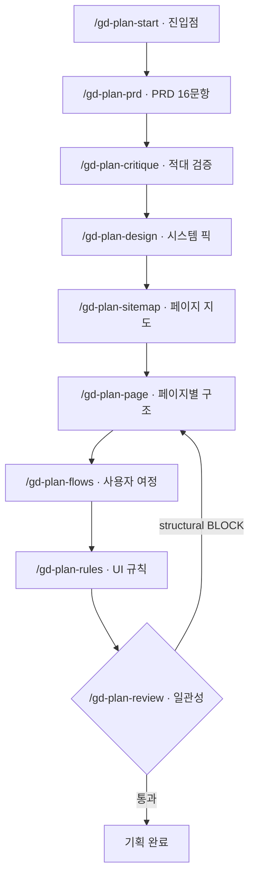

# gd-plan

*디자이너 없이, 검증된 디자인 시스템 위에서 PRD·구조·플로우·UI규칙을 **인터뷰로 생성**하는 Claude Code 스킬 패키지.*

> 상류(上流) 기획 레이어 — "무엇을 만들 것인가"를 코드 한 줄 짜기 전에 문서로 먼저 세운다.
> 66개 검증된 디자인 시스템 위에서만 생성해 일관성을 강제한다. v0 / Lovable / Bolt 처럼 매번 들쭉날쭉하지 않다.

[](./package.json)
[](#license)
[](#)
[](#-대상-환경--의존성)

---

## 목차

- [💡 이게 무엇인가](#-이게-무엇인가)
- [🎯 언제 쓰나 / 대상](#-언제-쓰나--대상)
- [📖 핵심 개념](#-핵심-개념)
- [🧩 무엇을 만드나 (9 스킬)](#-무엇을-만드나-9-스킬)
- [📦 설치 (소비자)](#-설치-소비자--node-불필요)
- [🚀 시작하기](#-시작하기)
- [🔄 업그레이드 / 상태](#-업그레이드--상태)
- [⌨ 명령 요약](#-명령-요약)
- [🖥 대상 환경 / 의존성](#-대상-환경--의존성)
- [🛠 개발 (기여자)](#-개발-기여자)
- [🗄 배포 모델](#-배포-모델)
- [📜 배경 — gen-design 분리](#-배경--gen-design-에서-분리)
- [❓ FAQ](#-faq)
- [License](#license)

---

## 💡 이게 무엇인가

AI 에게 "화면 만들어줘"라고 바로 시키면 결과가 매번 달라집니다. 더 깊은 문제는 **무엇을·누구를 위해 만드는지**가 흐린 채로 화면부터 쌓이는 것 — 나중에 "이 버튼이 왜 여기 있지?"에 아무도 답하지 못합니다.

gd-plan 은 그 앞단을 메웁니다. **화면 생성 이전의 기획 산출물**(PRD → 디자인 시스템 → 사이트맵 → 페이지 구조 → 사용자 플로우 → UI 규칙)을 **인터뷰**로 끌어내 문서로 고정합니다. 두 가지를 구조로 강제합니다.

- **검증된 디자인 시스템 위에서만 생성** — `design-md-collection/` 의 66개 검증 시스템에서 고르고 복사할 뿐, AI 가 매번 새로 지어내지 않습니다. 그래서 일관적입니다.
- **연결 무결성** — `역할 → 기능 → 페이지 → 플로우` 의 고리가 끊기면 `/gd-plan-review` 가 다음 단계를 BLOCK 합니다. "구조적으로 완성"과 "의미적으로 정합"을 따로 검증합니다.

## 🎯 언제 쓰나 / 대상

gd-plan 은 **기획 앞단(planning-front)** 도구입니다. 적합 여부를 가르는 축은 *신규 repo 냐 기존 repo 냐* 가 아니라 ***기획 앞단이냐 구현 뒷단이냐*** 입니다.

| | ✅ 적합 | ❌ 부적합 |
|---|---|---|
| 상황 | 새 제품·새 기능을 **기획하는 시점** | 이미 만들어진 코드에 PRD 를 **사후 끼워넣기** |
| 예 | 신규 서비스, 기존 repo 안의 새 모듈/기능 기획 | 완성된 화면을 역으로 문서화 |

자매 도구인 **harness-kit** 과 짝으로 보면 명확합니다.

| | gd-plan | harness-kit |
|---|---|---|
| 레이어 | **콘텐츠(기획)** — "무엇을 만드나" | **프로세스** — "어떻게 일하나" |
| 설치 시점 | 제품/기능의 **앞단(기획 시점)** | 아무 프로젝트·아무 시점 (코드 위 거버넌스) |

> 기존 프로젝트라도 그 안에서 *새 기능을 기획*한다면 그 단위로 PRD 부터 쓰는 건 자연스럽습니다. 부적합한 건 "이미 완성된 것의 사후 문서화"입니다.

## 📖 핵심 개념

**연결 모델** — 모든 산출물은 하나의 ID 스파인으로 이어집니다.

```
역할(role) → 기능(capability, [CAP-NN]) → 페이지(page, [PAGE-slug]) → 플로우(flow)
```

끊긴 고리(예: 어떤 페이지에도 covers 되지 않는 기능)는 `/gd-plan-review` 가 **structural BLOCK** 으로 잡습니다.

**검증 2층** — "완성"을 두 각도로 따로 검증합니다.

| 층 | 명령 | 질문 | 방식 |
|---|---|---|---|
| 의미 정합 | `/gd-plan-critique` | "말이 되나?" (루프 미완결·규제 누락·측정불가) | 독립 서브에이전트의 적대적 비판 |
| 구조 정합 | `/gd-plan-review` | "아귀가 맞나?" (연결 고리·일관성) | lint (structural BLOCK / style WARN) |

> 구조적 완성 ≠ 의미적 정합. 정합적이지만 *틀린* PRD 를 critique 가 잡습니다.

**산출 구성** — 9개 스킬이 **5종 기획 문서**(prd · design · 구조[sitemap+pages] · flows · ui-rules) + **검증 2층**(critique · review) + **진입점**(start)을 이룹니다.

## 🧩 무엇을 만드나 (9 스킬)

| 명령 | 산출물 | 역할 |
|---|---|---|
| `/gd-plan-start` | — | 진입점. `docs/` 스캔 → 진행률 보고 + 다음 명령 안내 |
| `/gd-plan-prd` | `docs/prd.md` | PRD 16문항 인터뷰 — 무엇을·누구를 (기능에 `[CAP-NN]` + 주체 역할) |
| `/gd-plan-critique` | `docs/_critique.md` | PRD 전제 적대 검증 (독립 서브에이전트 · 의미 정합). 채택분만 사람이 반영 |
| `/gd-plan-design` | `docs/design.md` | 검증된 디자인 시스템 픽 (collection 에서 복사 — 사람이 작성 안 함) |
| `/gd-plan-sitemap` | `docs/sitemap.md` | 페이지 로스터(지도). 모든 CAP 이 ≥1 페이지에 covers 되는지 점검 |
| `/gd-plan-page` | `docs/pages/[PAGE-slug]/` | 페이지 1개 세로 슬라이스 — `structure.md`(섹션스택+ID) + `decisions.md` |
| `/gd-plan-flows` | `docs/flows/<slug>.md` | 화면을 가로지르는 사용자 여정 (Actor + Steps + mermaid) |
| `/gd-plan-rules` | `docs/ui-rules.md` | UI 규칙 확정 — Motion/Form/CTA위계/a11y 인터뷰로 보강 |
| `/gd-plan-review` | `docs/_review.md` | 5종 문서 일관성 검증 (structural BLOCK / style WARN) |

> 모든 생성 스킬은 **idempotent** — 언제 다시 호출해도 안전합니다.

## 📦 설치 (소비자 — node 불필요)

harness-kit 형태로 `curl | bash` 한 줄 설치합니다. 소비자 측은 **bash + curl + tar + shasum** 만 있으면 됩니다 (node 불필요).

```bash
# 현재 프로젝트(또는 <dir>)에 설치
bash <(curl -fsSL https://raw.githubusercontent.com/pgaey/gd-plan/main/get.sh) --yes <dir>
```

| 옵션 | 설명 |
|---|---|
| `--yes` | 모든 프롬프트 자동 수락 |
| `--version <ver>` | 특정 버전 설치 (git tag `v<ver>` 기준) |
| `--src <dir>` | 로컬 체크아웃에서 설치 (다운로드 생략 — 테스트·오프라인) |

> 전체 옵션은 `get.sh --help`.

설치되는 것 (footprint):

```
.claude/commands/gd-plan-*.md   스킬 9 (소비자 측 슬래시 커맨드)
.gd/templates/                  prd·sitemap·pages·ui-rules·section-taxonomy·decisions
.gd/design-md-collection/       검증된 디자인 시스템 66개 + _index.json (전체 동봉 — 픽 시 네트워크 0)
.gd/bin/gd                      소비자 CLI (status·upgrade·version)
.gd/VERSION · .gd/manifest      설치 버전 + 파일 무결성(shasum)
docs/                           사용자 산출물 — 설치/업그레이드 절대 미접촉
CLAUDE.md                       gd-plan fragment @import 1줄 추가 (사용자 내용 보존)
```

설치 후 Claude Code 에서 `/gd-plan-start` 로 시작합니다.

## 🚀 시작하기

`/gd-plan-start` 가 진입점입니다. 이후 파이프라인을 순서대로 따라갑니다.



1. **`/gd-plan-start`** — 무엇이 채워졌고 다음에 뭘 할지 안내받습니다.
2. **`/gd-plan-prd`** → **`/gd-plan-critique`** — PRD 를 세우고 전제를 적대적으로 검증합니다.
3. **`/gd-plan-design`** — 66개 중 후보를 좁혀 디자인 시스템을 픽합니다.
4. **`/gd-plan-sitemap`** → **`/gd-plan-page`** — 페이지 지도를 깔고 페이지를 하나씩 채웁니다.
5. **`/gd-plan-flows`** → **`/gd-plan-rules`** — 여정과 UI 규칙을 확정합니다.
6. **`/gd-plan-review`** — 연결 고리를 검증합니다. structural 불일치는 BLOCK 으로 되돌립니다.

## 🔄 업그레이드 / 상태

설치된 소비자 측 CLI (`node` 불필요):

```bash
.gd/bin/gd status     # 설치 버전 vs 원격 최신 비교 + 사용자 수정 파일 표시
.gd/bin/gd upgrade    # 최신으로 갱신 (수정한 파일은 <file>.new 로 보존 — 손실 없음)
.gd/bin/gd version    # 설치 버전 출력
```

## ⌨ 명령 요약

### 슬래시 커맨드 (Claude Code 안에서)

| 명령 | 설명 |
|---|---|
| `/gd-plan-start` | 진입점 — 진행률 + 다음 명령 안내 |
| `/gd-plan-prd` | PRD 16문항 인터뷰 |
| `/gd-plan-critique` | PRD 적대 검증 (의미 정합) |
| `/gd-plan-design` | 디자인 시스템 픽 |
| `/gd-plan-sitemap` | 페이지 로스터(지도) |
| `/gd-plan-page` | 페이지별 구조·결정 |
| `/gd-plan-flows` | 사용자 여정 (mermaid) |
| `/gd-plan-rules` | UI 규칙 확정 |
| `/gd-plan-review` | 구조 일관성 검증 (BLOCK/WARN) |

### 소비자 CLI (`gd`)

| 명령 | 설명 |
|---|---|
| `gd status` | 설치 버전 vs 원격 최신 비교 |
| `gd upgrade` | 최신으로 갱신 (수정 파일 `.new` 보존) |
| `gd version` | 설치 버전 출력 |

## 🖥 대상 환경 / 의존성

| 항목 | 지원 | 비고 |
|---|:---:|---|
| **AI 호스트** | Claude Code 전용 | `.claude/commands/` 슬래시 커맨드에 의존 |
| **소비자 측** | bash + curl + tar + shasum | **node 불필요** |
| **개발(이 repo)** | node + pnpm | 컬렉션 인덱스 빌드·테스트용 |

## 🛠 개발 (기여자)

```bash
pnpm install
pnpm build            # dist/ 생성
pnpm build-index      # design-md-collection/_index.json 재생성
pnpm test             # vitest 회귀
pnpm test:sh          # get.sh·gd 셸 테스트
pnpm typecheck
```

> `node dist/cli.js` (구 설치기) 는 **deprecated** — 스킬 9개만 복사하고 templates·컬렉션·CLI 를 빠뜨려 외부에서 동작하지 않습니다. 소비자 설치는 위 `get.sh` 를 사용하세요.

## 🗄 배포 모델

`get.sh` 는 얇은 부트스트랩입니다 — tar.gz 1요청 다운로드 → 해제 → 내부 `install.sh` 위임 (harness-kit 동형). 컬렉션 전체를 동봉해 **픽 시 네트워크 의존이 0** 입니다.

- 배포 설계 상세: [`docs/decisions/ADR-016-self-contained-distribution.md`](docs/decisions/ADR-016-self-contained-distribution.md)
- 릴리스 절차(수동 semver bump + 태그): [`docs/RELEASE.md`](docs/RELEASE.md)

## 📜 배경 — gen-design 에서 분리

원래 `gen-design` monorepo 의 `packages/gd-plan`(상류 기획 레이어)으로 설계됐으나, 기존 코드베이스와 호환 결합이 없어 **독립 repo 로 분리**했습니다. 분리 전 설계 기록은 `specs/spec-13-01-gd-plan-package/` 에 참고용으로 남아 있습니다(gen-design 맥락 일부 포함 — 본 repo 의 실제 범위는 위 standalone 구성입니다).

## ❓ FAQ

**Q. 이미 만들어진 프로젝트에 써도 되나요?**
완성된 코드를 *사후 문서화*하는 용도로는 부적합합니다. 다만 그 프로젝트 안에서 **새 기능을 기획**한다면 그 단위로 PRD 부터 쓰는 건 자연스럽습니다. 적합 축은 repo 의 신규/기존이 아니라 "기획 앞단이냐 구현 뒷단이냐"입니다 ([언제 쓰나](#-언제-쓰나--대상)).

**Q. node 가 꼭 필요한가요?**
소비자는 **불필요**합니다. `bash + curl + tar + shasum` 만 있으면 됩니다. node/pnpm 은 이 repo 에 기여(컬렉션 인덱스 빌드·테스트)할 때만 씁니다.

**Q. 원하는 디자인 시스템이 컬렉션에 없으면요?**
gd-plan 은 검증된 66개 위에서만 일관성을 보장합니다. 컬렉션에 없는 시스템은 본 패키지 범위 밖입니다(추가는 별도 작업).

**Q. `critique` 와 `review` 차이는?**
`critique` 는 *의미 정합*("말이 되나")을 독립 서브에이전트가 적대적으로 검증하고, `review` 는 *구조 정합*("아귀가 맞나")을 lint 로 검증합니다. 구조가 완성돼도 의미가 틀릴 수 있어 둘을 분리합니다 ([핵심 개념](#-핵심-개념)).

**Q. 산출물을 잘못 만들면 다시 돌려도 되나요?**
모든 생성 스킬은 idempotent 입니다 — 다시 호출해도 안전합니다.

## License

MIT
