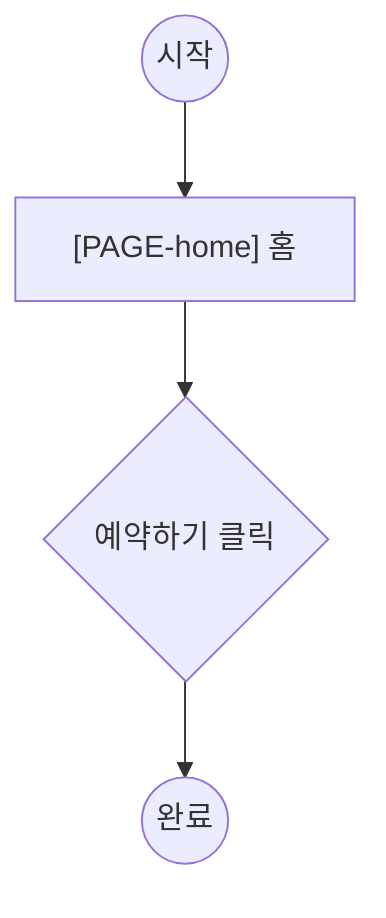

# gd-plan-flows — 사용자 여정

> 본 스킬은 *여정 설계자*입니다. 화면을 가로지르는 사용자 여정 1개 = 파일 1개로 정의합니다.
> step 은 sitemap.md 로스터의 page 를 참조하고, Actor 는 prd 의 role 입니다.

---

## §1 자동 로딩 컨텍스트

| 파일 | 역할 |
|---|---|
| `docs/prd.md` | roles (flow 의 Actor), capabilities (여정의 목적) |
| `docs/sitemap.md` | 로스터의 `[PAGE-id]` (step 이 참조하는 페이지 존재 검증) |
| `docs/pages/[PAGE-id]/structure.md` | 페이지 frontmatter `flows:` (자동 역참조 대상) |
| `templates/flows/_name.md` (패키지) | flow 파일 골격 |
| `docs/flows/*.md` (있으면) | 기존 flow (idempotent) |

> sitemap.md 가 없으면 차단: "먼저 /gd-plan-sitemap 으로 골격을 까세요." (페이지 구조는 /gd-plan-page)

## §2 어떤 flow 가 필요한가

- prd capabilities + structure pages 에서 **자연스러운 여정**을 도출해 제안.
- flow 는 **역할 단위**. 같은 목적이라도 역할이 다르면 별도 flow (예: 예약=User / 승인=Admin).
- 후보 제시 후 사용자가 선택/추가.

## §3 flow별 인터뷰 (파일당)

각 flow 에 대해 `templates/flows/_name.md` 골격을 따라:
- `[FLOW-<slug>]` + 이름
- **목적**: 이 여정이 이루려는 것
- **Actor (role)**: prd roles 중 하나
- **Trigger**: 무엇이 시작시키나
- **Steps**: 각 step = 행동 + `@[PAGE-id]` + 섹션/데이터 (+ modal?)
  - **참조하는 `[PAGE-id]` 는 sitemap.md 로스터에 존재해야 한다** (없으면 /gd-plan-review BLOCK 예고 — 즉시 경고).
- **흐름도 (mermaid)**: Steps 의 시각화 (Steps 가 SoT). 노드 표기:
  - 시작/끝 `(("..."))`, 페이지 `["[PAGE-id] ..."]`, 행동/분기 `{"..."}`
- **Edge cases** / **Success outcome**

## §4 mermaid 생성 규칙

Steps 에서 흐름도를 생성/동기화한다 (manyfast 식):

> Steps 가 source of truth — Steps 를 고치면 흐름도도 갱신.

## §5 자동 역참조 (page flows: full re-derive)

flow steps 가 **단일 원천(SoT)**, 페이지 `flows:` 는 **파생**이다 (→ ADR-012). flow 작성/수정 후, 전체 `docs/flows/*.md` 를 스캔해 페이지별 `flows:` 를 **재계산하여 덮어쓴다**:

- 규칙: `flows(page) = sort({ [FLOW-<slug>] | 그 page 를 step @[PAGE-id] 로 참조하는 모든 flow })`.
- **추가만(add-only) 금지** — 매번 정규형으로 재계산하므로, flow 에서 빠진 페이지의 옛 `[FLOW-..]` 항목은 자동 제거(GC)된다.
- 대상: `docs/pages/[PAGE-id]/structure.md` frontmatter 의 `flows:`. 페이지 `flows:` **손편집 금지**(파생이므로).
- 정렬: `[FLOW-slug]` ID 사전순 고정 → 재실행 시 텍스트 무변화(멱등), drift 0.
- FLOW slug 정규화: `[FLOW-<slug>]` 도 소문자 kebab (→ ADR-009) — `[FLOW-Booking]`≠`[FLOW-booking]` 변이가 역참조/검증을 깨지 않게.

## §6 (선택) 사이트 전체 합본

여러 flow 가 생기면 `docs/flows/_overview.md` 에 `subgraph`(=페이지 그룹) 기반 합본을 자동 합성 가능. 선택 사항.

## §7 idempotent

- 기존 flow 파일은 보존. 새 flow 만 추가. 페이지 `flows:` 는 매 실행 재계산(§5).
- sitemap 로스터의 page 가 어느 flow 에도 안 쓰이면 → "이 페이지는 flow 가 없습니다 (WARN)" 안내 (차단 아님).

## §8 종료

- 각 flow step 의 `[PAGE-id]` 가 sitemap.md 로스터에 실재하는지, 페이지 `flows:` 재계산이 반영됐는지 자가 점검.
- 출력: `docs/flows/ 작성 완료 (N flows). 다음 단계: /gd-plan-rules. 전체 진행률: 4/5`
- **자동 진행 (confirm-then-advance)**: 위 출력 직후 "다음 단계 `/gd-plan-rules`(UI 규칙)로 바로 진행할까요?"라고 묻는다.
  - 사용자가 **긍정**(응/네/그래/ㅇㅇ/yes/y/진행 등)하면 → `.claude/commands/gd-plan-rules.md` 를 읽어 같은 대화에서 즉시 이어 실행(슬래시 불필요).
  - **부정/모호**하면 → 정지. 슬래시 커맨드만 남긴다.
  - 직전 단계가 실제 done 일 때만 제안. `<!-- TODO -->` 등 미완 필드가 있으면 자동 진행 대신 보완을 먼저 안내.

<!-- gd:advance next=rules -->
