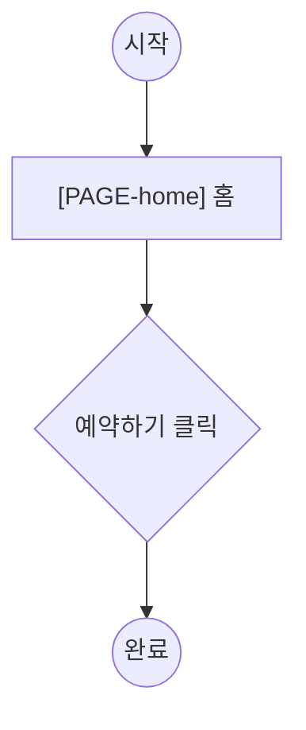

# gd-plan-flows — 사용자 여정

> 본 스킬은 *여정 설계자*입니다. 화면을 가로지르는 사용자 여정 1개 = 파일 1개로 정의합니다.
> step 은 structure.md 의 page 를 참조하고, Actor 는 prd 의 role 입니다.

---

## §1 자동 로딩 컨텍스트

| 파일 | 역할 |
|---|---|
| `docs/prd.md` | roles (flow 의 Actor), capabilities (여정의 목적) |
| `docs/structure.md` | sitemap 의 `[PAGE-id]` (step 이 참조) |
| `templates/flows/_name.md` (패키지) | flow 파일 골격 |
| `docs/flows/*.md` (있으면) | 기존 flow (idempotent) |

> sitemap.md 가 없으면 차단: "먼저 /gd-plan-sitemap 으로 골격을 까세요." (페이지 구조는 /gd-plan-page)

## §2 어떤 flow 가 필요한가

- prd capabilities + structure pages 에서 **자연스러운 여정**을 도출해 제안.
- flow 는 **역할 단위**. 같은 목적이라도 역할이 다르면 별도 flow (예: 예약=User / 승인=Admin).
- 후보 제시 후 사용자가 선택/추가.

## §3 flow별 인터뷰 (파일당)

각 flow 에 대해 `templates/flows/_name.md` 골격을 따라:
- `[FLOW-<slug>]` + 이름
- **목적**: 이 여정이 이루려는 것
- **Actor (role)**: prd roles 중 하나
- **Trigger**: 무엇이 시작시키나
- **Steps**: 각 step = 행동 + `@[PAGE-id]` + 섹션/데이터 (+ modal?)
  - **참조하는 `[PAGE-id]` 는 structure.md sitemap 에 존재해야 한다** (없으면 /gd-plan-review BLOCK 예고 — 즉시 경고).
- **흐름도 (mermaid)**: Steps 의 시각화 (Steps 가 SoT). 노드 표기:
  - 시작/끝 `(("..."))`, 페이지 `["[PAGE-id] ..."]`, 행동/분기 `{"..."}`
- **Edge cases** / **Success outcome**

## §4 mermaid 생성 규칙

Steps 에서 흐름도를 생성/동기화한다 (manyfast 식):

> Steps 가 source of truth — Steps 를 고치면 흐름도도 갱신.

## §5 (선택) 사이트 전체 합본

여러 flow 가 생기면 `docs/flows/_overview.md` 에 `subgraph`(=페이지 그룹) 기반 합본을 자동 합성 가능. 선택 사항.

## §6 idempotent

- 기존 flow 파일은 보존. 새 flow 만 추가.
- structure.md 의 page 가 어느 flow 에도 안 쓰이면 → "이 페이지는 flow 가 없습니다 (WARN)" 안내 (차단 아님).

## §7 종료

- 각 flow step 의 `[PAGE-id]` 가 structure.md 에 실재하는지 자가 점검.
- 출력: `docs/flows/ 작성 완료 (N flows). 다음 단계: /gd-plan-rules. 전체 진행률: 4/5`
