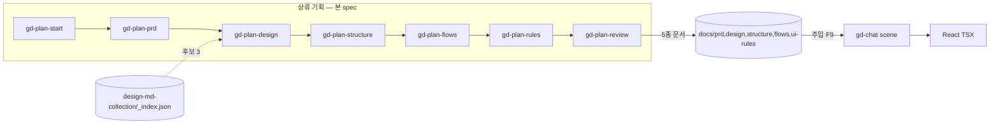

# Implementation Plan: spec-13-01 (gd-plan 패키지 코어)

## 📋 Branch Strategy

- 신규 브랜치: `spec-13-01-gd-plan-package` (브랜치 이름 = spec 디렉토리 이름, `feature/` prefix 없음)
- 시작 지점: `main`
- 첫 task(Task 1-1)가 브랜치 생성을 수행함. base branch 모드 아님 (각 spec → main).

## 🛑 사용자 검토 필요 (User Review Required)

> 본 Plan 을 Accept 하기 전에 명시적으로 확인해야 할 항목. **대부분 spec 과 실제 코드의 갭** — Explore 구조 매핑에서 발견.

> [!IMPORTANT] — critique(2026-05-29) 반영으로 대부분 해소됨
> - [x] **F9 §번호 재매핑** — spec 정정 완료 (컨텍스트=§1 / 신규 §5.10 / 생성=§6-8 / 종료=§12).
> - [x] **gd-chat 편집 대상 = preset 본** — spec F9 에 canonical(`create-gd-react/.../gd-chat.md`) 명시. skills/ 는 sync.
> - [x] **Spec 규모** — critique 추천(v1 단순화) 수용: `4·5·6·7·8·12` → v2 백로그 / `9·10·11` 군더더기 제거 / ADR 6→3. 범위 축소 → **단일 PR 유지**.

> [!WARNING]
> - [x] **gd-chat 길이** — 하드 cap 제거, **권고**로 완화 (현재 ~598줄).
> - [ ] **패키지명/버전** (Plan Accept 시 확정): `@gen-design/plan@0.1.0` 신규 / create-gd-react·skills 0.2.2 → **0.3.0**.
> - [x] **design.md 복사** — 정의 명확화 + `sourceHash`/`pickedVersion` 는 **v2 백로그**로 이전.

## 🎯 핵심 전략 (Core Strategy)

### 아키텍처 컨텍스트



### 주요 결정

| 컴포넌트 | 전략 | 이유 |
|:---:|:---|:---|
| **gd-plan 패키지** | `gd-skills` 컨벤션 미러 (tsup, vitest, `plans/`↔`skills/`, prebuild sync) | 기존 배포 파이프라인 재사용 |
| **스킬 source-of-truth** | preset `.claude/commands/` 가 upstream, `plans/`·`skills/` 는 sync 산출물 | 기존 `sync-skills` 메커니즘과 일관 |
| **_index.json 빌더 위치** | `packages/gd-plan/src/build-index.ts` (gd-plan build 시 실행) + `gd plan refresh-index`(gd-cli thin wrapper) | 빌더는 gd-plan 책임, CLI 표면은 `pnpm gd` UX |
| **review 차단 정책** | v1: structural=BLOCK / style·vocabulary=WARN (wording·completeness·set-diff = v2), `--force-continue` | spec F6 |
| **멀티 에이전트** | gd-plan-design=Sonnet, gd-plan-review=Opus (모델 = non-normative 권장 힌트) | spec F5, 서브 없이도 동작 |

### 📑 ADR 후보

- [x] ADR 가치 있는 결정 있음 → **5개**: `A` 레이어별 SSOT(invariant) / `B` design.md picker(decision) / `C` review 차단(tradeoff) / `D` structure=섹션스택(convention) / `E` role+접근모델(decision). (critique 6→3 후 설계정련에서 D·E 추가)
- [ ] 없음

## 📂 Proposed Changes

### gd-plan 신규 패키지

#### [NEW] `packages/gd-plan/package.json`
`@gen-design/plan@0.1.0`. tsup build, vitest, `bin: dist/cli.js`. scripts: `build`, `build-index`, `prebuild`(sync-plans + build-index), `test`, `prepublishOnly`. `sync-plans` = preset `.claude/commands/gd-plan-*.md` → `plans/`.

#### [NEW] `packages/gd-plan/src/cli.ts`
`gd-plan` 스킬 설치기(gd-skills/src/cli.ts 미러 — `plans/*.md` → `.claude/commands/`).

#### [NEW] `packages/gd-plan/src/build-index.ts`
`design-md-collection/*.md` 66개 스캔 → `design-md-collection/_index.json` (domain/tone/color/typography/density 요약). collection-scanner 가 소비.

#### [NEW] `packages/gd-plan/plans/gd-plan-{start,prd,design,structure,flows,rules,review}.md` (7 스킬)
한국어 본문, idempotent, 출력 포맷 `"docs/<file> 작성 완료. 다음 단계: /gd-plan-<next>. 전체 진행률: N/7"`. 기본 ≤400줄 (structure/review ≤600).

#### [NEW] `packages/gd-plan/templates/{prd,design,structure,ui-rules}.md` + `templates/flows/_name.md`
spec F2 5종 템플릿 (design.md 는 frontmatter `pickedFrom/pickedAt/reason` 포함, ui-rules.md 는 sample 수치 포함).

#### [NEW] `packages/gd-plan/__tests__/skills.test.ts` + `vitest.config.ts`
스킬 7개 존재 + 출력 포맷 라인 존재 + 길이 cap 검증. build-index 결과 검증(66 entry, 유효 schema).

### design-md-collection

#### [NEW] `design-md-collection/_index.json`
초기 빌드 산출물 (커밋, gitignore X — spec NFR8).

#### [MODIFY] `packages/gd-cli/src/commands/` (+ cli.ts 라우팅)
`gd plan refresh-index` 서브명령 추가 — gd-plan 의 build-index 호출. 테스트: 명령 실행 → _index.json 생성.

### /gd-chat 주입 (F9) — 본 spec 핵심

#### [MODIFY] `packages/create-gd-react/presets-bundled/default/.claude/commands/gd-chat.md` (canonical)
- **§1 (자동 로딩 컨텍스트)**: `.gd/memory` 외에 `docs/{prd,structure,flows/*,ui-rules,design}.md` 5종 로드 추가 (해당 scene 섹션만 grep).
- **신규 §5.10 사전 검증 (Sitemap)**: structure.md 에 scene 정의 없으면 **차단**, flows 부재 시 WARN, ui-rules 수치 충돌 WARN.
- **§6/§7/§8 생성 규칙**: F9 규칙표 참조 — Narrative 톤=prd persona+design 톤, Structure 순서=structure.md, 수치=ui-rules.
- **§12 종료 조건**: 일관성 검증(트리 어휘, design 톤 일치) 항목 추가.

#### [MODIFY] `packages/gd-skills/skills/gd-chat.md`
`pnpm --filter @gen-design/skills sync-skills` 로 preset 본에서 자동 전파 (수동 편집 아님).

### create-gd-react 스캐폴드 (F7)

#### [NEW] `packages/create-gd-react/presets-bundled/default/docs/{prd,design,structure,ui-rules}.md` + `docs/flows/.gitkeep`
빈 템플릿 (design.md 는 빈 — gd-plan-design 후 채움).

#### [NEW] `presets-bundled/default/.claude/commands/gd-plan-*.md` (7)
gd-plan 스킬 번들.

#### [MODIFY] `packages/create-gd-react/src/cli.ts` / `postprocess.ts`
docs/ 폴더 스캐폴드 보장. `__tests__/` 에 docs/ + gd-plan 스킬 생성 검증 추가.

#### [MODIFY] `packages/create-gd-react/README.md`
9단계 흐름 추가 (`/gd-plan-start → … → /gd-plan-review → /gd-start → /gd-chat → pnpm gd react`).

### 버전 / 번들 (F8)

#### [MODIFY] `packages/create-gd-react/package.json` (0.3.0), `packages/gd-skills/package.json` (0.3.0)
gd-skills `sync-skills` 글롭(`*.md`)이 gd-plan-*.md 도 자동 포함 → 별도 수정 불필요(확인).

### 문서 (F10)

#### [MODIFY] `README.md`, `docs/handbook.md`, `docs/vision.md`
TL;DR gd-plan 흐름 / 상·하류 책임 도식(ASCII) / design system picker 차별점.

#### [NEW] `docs/decisions/ADR-13-01-{A,B,C,D,E,F}.md` (6)
spec ADR 후보, `type: decision`.

## 🧪 검증 계획 (Verification Plan)

### 단위 테스트 (필수)
```bash
pnpm --filter @gen-design/plan test       # 스킬 포맷 + build-index
pnpm --filter @gd/cli test                # gd plan refresh-index
pnpm --filter create-gd-react test        # 스캐폴드 docs/ + gd-plan 스킬
```

### 통합 테스트 (Integration Test Required = yes)
spec 통합 시나리오 1/2/3 (인터뷰 / 주입 / 차단). 스킬 상호작용 흐름이라 **반자동(스크립트 + 사람 확인)** — 절차는 walkthrough 에 증거 첨부.
```bash
pnpm -r test                               # 회귀 (기존 skills/cli/create 통과)
```

### 수동 검증 시나리오
1. 빈 프로젝트에서 `/gd-plan-start → … → /gd-plan-review` → 5종 문서 + `_review.md` BLOCK 0 — 기대: 인터뷰 완주.
2. 위 산출물 + `/gd-chat <landing>` → chat.md 톤이 design.md 와 일치 — 기대: 주입 동작.
3. PRD capability 누락 후 `/gd-plan-review` → BLOCK, `/gd-chat` 진입 차단 — 기대: 하이브리드 차단.

## 🔁 Rollback Plan

- 신규·가산 변경 위주 → `packages/gd-plan/` 삭제 + preset/gd-chat 편집 revert + 버전 bump revert + `_index.json` 삭제로 원복.
- 데이터/상태 영향 없음 (런타임 마이그레이션 없음). gd-chat.md 는 git revert 로 598줄 원복.

## 📦 Deliverables 체크

- [x] phase.md SPEC 표 갱신 (sdd 자동)
- [ ] task.md 작성 (다음 단계)
- [ ] 사용자 Plan Accept 받음
- [ ] (실행 후) 모든 task 완료
- [ ] (실행 후) walkthrough.md / pr_description.md ship
