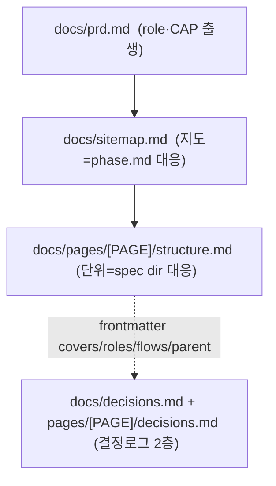

# spec-01-01: 디렉토리 모델 + 템플릿 + ADR (세로 슬라이스 토대)

## 📋 메타

| 항목 | 값 |
|---|---|
| **Spec ID** | `spec-01-01` |
| **Phase** | `phase-01` |
| **Branch** | `spec-01-01-dir-model-templates` |
| **상태** | Planning |
| **타입** | Refactor (출력 스키마 재편 — 신규 템플릿 추가) |
| **Integration Test Required** | no (통합은 spec-1-02/04 합류 후 phase 레벨 시나리오) |
| **작성일** | 2026-06-03 |
| **소유자** | evan |

## 📋 배경 및 문제 정의

### 현재 상황

gd-plan 출력은 **평면 5문서**(prd/design/structure/flows/ui-rules)다. `structure.md` 한 파일이 전 페이지를 담고, 결정 이유는 어디에도 안 남으며, `role→capability→page→flow` 연결은 프리텍스트라 기계 검증이 불가능하다.

### 문제점

- **거시 부재**: 큰 프로젝트도 평면 한 파일 → 페이지를 하나씩 증분 추가하는 단위가 없다.
- **기록 휘발**: 인터뷰/픽의 *결정 이유*가 안 남아 "목적 표류"를 대조할 원본이 없다.
- **기계가독 부재**: ID 연결이 산문이라 향후 set-diff hook(누수 B)의 토대가 없다.

### 해결 방안 (요약)

세로 슬라이스 재편의 **토대만** 깐다 — 즉 **출력 스키마(템플릿) + ADR**만 정의하고, 스킬 행동(명령어)은 건드리지 않는다(→ spec-1-02). 신규 템플릿: `sitemap.md`(지도) + `pages/structure.md`·`pages/decisions.md`(페이지 단위) + `decisions.md`(전역). frontmatter ID 스파인(`page/covers/roles/flows/parent`)을 규약으로 못박는다.

## 📊 개념도

## 🎯 요구사항

### Functional Requirements

1. **`templates/sitemap.md` 신규** — 마커 `<!-- gd:pages:start --> ~ <!-- gd:pages:end -->` 로 감싼 로스터 표(`Page | covers(CAP) | roles | 상태 | flows`) + 목표 한 줄 + 커버리지 점검 섹션. 상태 허용값 `todo/draft/done`.
2. **`templates/pages/structure.md` 신규** — 페이지 1개 단위 와이어프레임. frontmatter 키 `page` · `covers` · `roles` · `flows` · `parent` + 본문(sections 섹션스택[taxonomy 어휘] · layout{lnb,sticky,modal} · responsive · states{empty,loading,error}).
3. **`templates/pages/decisions.md` 신규** — 페이지 결정 로그. typed 표(`결정 | 선택지 | 탈락 | 이유`). 트랜스크립트 금지 명시.
4. **`templates/decisions.md` 신규** — 전역 결정 로그(prd/design/rules 단계 결정). 동일 typed 표 형식.
5. **frontmatter ID 스파인 규약** — 각 신규 템플릿 상단 주석에 `covers=[CAP-..]`, `roles=[role]`, `flows=[FLOW-.. step N]`, `parent=[PAGE-..]` 의미와 출생/참조 방향 명시.
6. **ADR 3종 작성** — `docs/decisions/`:
   - `ADR-006` 세로축 단위 = PAGE (page dir ↔ spec dir 대응). **ADR-004(평면 섹션스택)의 확장이지 폐기 아님** 명문화.
   - `ADR-007` `sitemap.md` = `phase.md` 대응 지도 (평면 로스터 + 마커 자동관리 + `parent` frontmatter 계층).
   - `ADR-008` 결정 로그 2층 + frontmatter ID 스파인 (기계가독 → set-diff 토대).
7. **검증 테스트 추가** — `__tests__/templates-v2.test.ts`: 신규 템플릿 4종 존재 + 필수 마커/frontmatter 키 포함 + ADR-006~008 존재(frontmatter `type` closure 준수).

### Non-Functional Requirements

1. **Backward compatible** — 기존 평면 템플릿(`structure.md`/`ui-rules.md`/`prd.md`/`flows/_name.md`/`section-taxonomy.md`)은 **유지**. 본 spec은 *추가만* 한다(구·신 정리는 스킬이 바뀌는 spec-1-02).
2. 기존 `__tests__/skills.test.ts` 회귀 PASS (7스킬·기존 템플릿·design.md 부재 불변).
3. 모든 본문 한국어.

## 🚫 Out of Scope

- 스킬(`/gd-plan-*`) 행동 변경 / 신규 명령어 → **spec-1-02**
- flows 자동 역참조 *로직* → **spec-1-04** (단, `flows:` frontmatter *형식*은 본 spec에서 정의)
- 결정 로그 자동 기록 *동작* → **spec-1-03** (본 spec은 템플릿 *형식*만)
- 기존 평면 템플릿 제거·마이그레이션 → **spec-1-02**

## 📑 ADR 후보 (Architecture Decision Records)

- [x] ADR 가치 있는 결정 있음 → `dir-model-page-unit`(type: convention) · `sitemap-as-map`(type: convention) · `decision-log-two-tier`(type: convention)
- [ ] 없음

## 🔗 관련 문서 (Related)

- 관련 ADR: `docs/decisions/ADR-004-structure-as-section-stack.md`(확장 대상), `docs/decisions/ADR-001-layered-ssot.md`
- 관련 메모리: `gd-plan-vertical-slice-rearchitecture`

## ✅ Definition of Done

- [ ] 모든 단위 테스트 PASS (`pnpm test`) + `pnpm typecheck`
- [ ] 신규 템플릿 4종 + ADR 3종 생성, 기존 회귀 PASS
- [ ] `walkthrough.md` 와 `pr_description.md` 작성 및 ship commit
- [ ] `spec-01-01-dir-model-templates` 브랜치 push 완료
- [ ] 사용자 검토 요청 알림 완료
