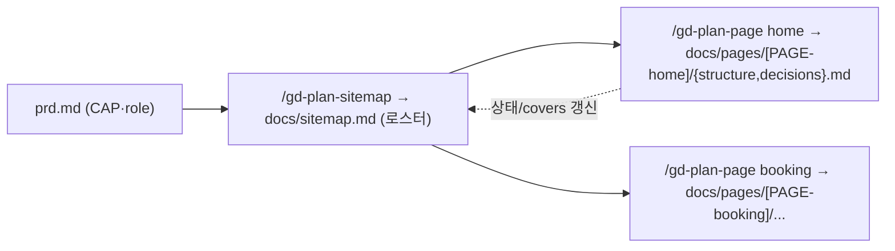

# spec-01-02: 세로 슬라이스 명령어 (sitemap + page) — 토대를 동작으로

## 📋 메타

| 항목 | 값 |
|---|---|
| **Spec ID** | `spec-01-02` |
| **Phase** | `phase-01` |
| **Branch** | `spec-01-02-vertical-slice-commands` |
| **상태** | Planning |
| **타입** | Feature (신규 스킬 2) + Refactor (structure 대체) |
| **Integration Test Required** | no (스킬 구조 단위 테스트로 충분; 전체 파이프라인은 phase 레벨) |
| **작성일** | 2026-06-04 |
| **소유자** | evan |

## 📋 배경 및 문제 정의

### 현재 상황
spec-01-01 이 세로 슬라이스 출력 스키마(`sitemap.md` / `pages/structure.md` / `pages/decisions.md` / `decisions.md` 템플릿 + ADR-006~008)를 깔았다. 그러나 이 템플릿을 *사용해* 실제 구조를 만드는 명령어가 없다. 현재 구조 생성은 평면 `/gd-plan-structure`(전 페이지 한 파일) 하나뿐.

### 문제점
- 토대(템플릿)는 있으나 *사용자가 새 구조를 만들 방법이 없다*.
- 평면 `/gd-plan-structure` 는 "페이지 하나씩 증분 추가"(세로 슬라이스)와 맞지 않는다.

### 해결 방안 (요약)
세로 슬라이스 명령어 2개를 추가하고 평면 structure 를 대체한다: **`/gd-plan-sitemap`**(prd capability → 페이지 로스터 = 골격) + **`/gd-plan-page <slug>`**(페이지 1개 dir 전체 = structure + decisions). `start`/`cli`/테스트를 새 구조에 맞춘다.

## 📊 개념도

## 🎯 요구사항

### Functional Requirements

1. **`/gd-plan-sitemap` 신규** — prd `capabilities`/`roles` 로딩 → "어느 CAP 을 어느 page 가 담당?" 인터뷰 → `docs/sitemap.md` 생성(`templates/sitemap.md` 기반, `<!-- gd:pages -->` 마커 로스터 채움). 멱등.
   - 모든 CAP 이 ≥1 page 에 covers 되도록 점검(미배정 경고).
   - **정합성 자가점검**: 로스터 행에 있으나 `docs/pages/[PAGE-x]/` 가 없음(유령 행) / dir 은 있으나 로스터 행이 없음(고아 dir) → 경고. 결정적 set-diff 강제는 review(spec-1-04) 소관.

2. **`/gd-plan-page <slug>` 신규** — 페이지 1개 세로 슬라이스.
   - **slug 정규화**: 소문자 kebab-case 강제(`Home`·`예약 상세` 등은 경고 후 `home`·사용자 지정 ASCII slug 로). `[PAGE-<slug>]` 가 식별자(→ ADR-009 후보).
   - **인자/선행 차단**: (a) 인자 누락 → 사용법 안내 후 중단. (b) `docs/sitemap.md` 부재 → "먼저 `/gd-plan-sitemap`" 차단. (c) 로스터에 없는 slug → "sitemap 에 먼저 등록할까요?" 확인 후 진행.
   - **산출**: `docs/pages/[PAGE-<slug>]/structure.md`(frontmatter `page`/`covers`/`roles`/`flows`(빈 배열)/`parent` + 섹션스택[section-taxonomy 어휘]/layout/states) + `decisions.md`(**헤더 + 규칙 주석만, 결정 행 0개** — 자동 기록은 spec-1-03).
   - **진실 방향**: page frontmatter `covers` = 진실. `sitemap.md` 로스터의 `covers`/상태 칸은 page 갱신을 따라가는 **파생/표시**(→ ADR-010 후보).
   - page 작성 후 `sitemap.md` 로스터 해당 행 상태 todo→draft/done 갱신.
   - **멱등**: 재호출 시 frontmatter·사용자 편집 sections 보존, 누락 섹션만 보강 + 로스터 상태 갱신.

3. **`/gd-plan-structure` 대체** — 평면 structure 스킬 제거, sitemap+page 쌍으로 흐름 재편. (gd-plan 미출시·`docs/` 비어 있어 마이그레이션 부담 0.)

4. **`/gd-plan-start` 갱신** — 대시보드가 새 구조 인식. **N/5 진행률 재정의**: 구 structure 슬롯을 sitemap+pages 집계로. 판정 — `sitemap.md` 없음=**미작성** / sitemap 있고 페이지 일부 draft=**초안** / 로스터 모든 page 가 done=**완료**. 분모 5 유지(sitemap+pages 를 1 슬롯으로). 다음 단계 안내 = sitemap→page 흐름.

5. **`src/cli.ts installPlans` 갱신** — 설치 스킬 목록에서 structure 제거 + sitemap/page 추가.

6. **테스트 갱신** — `__tests__/skills.test.ts` 의 `EXPECTED_SKILLS`(structure → sitemap + page) + 신규 스킬 frontmatter/`전체 진행률`/`다음 단계` 검증.

7. **flows 차단 메시지 갱신**(막다른 길 방지) — `plans/gd-plan-flows.md` 의 하드 차단 안내 "먼저 `/gd-plan-structure`" → "먼저 `/gd-plan-sitemap`". (flows 의 경로·역참조 **로직 전체**는 spec-1-04 — 본 spec 은 죽은 명령 가리키는 **안내 문자열 1줄**만 흡수.)

### Non-Functional Requirements
1. 멱등 — 모든 신규 스킬 재실행 안전.
2. 한국어 본문. 본문 길이 cap 기본 400. **`gd-plan-page` 길이 예외는 작성 후 실제 줄 수를 보고 결정**(선예외 안 둠).
3. `prd`/`design` 스킬 불변. `rules`/`review` 의 structure.md→pages 경로 갱신은 본 spec 밖(→ spec-1-04).

## 🚫 Out of Scope
- 결정 로그 *자동 기록*(fork 훅) → **spec-1-03** (page 는 `decisions.md` *헤더+행0* 골격만).
- flows 자동 역참조 + frontmatter `flows:` 도출 → **spec-1-04** (page 의 `flows:` 는 빈 배열).
- `rules`/`review` 의 structure.md→`pages/*/structure.md` 경로·BLOCK 규칙 갱신 → **spec-1-04** (flows 는 안내 1줄만 본 spec).
- `templates/structure.md`(평면) 파일 자체 제거 → 보류(잔존 무해).
- **Interim 경계**: structure 제거 ~ spec-1-04 사이 `flows`/`rules`/`review` 실행은 **미보증**(structure.md 참조가 깨짐). 전체 파이프라인 정상화는 spec-1-04, 검증은 phase Done 통합 시나리오.

## 📑 ADR 후보 (Architecture Decision Records)
- [x] ADR 가치 있는 결정 있음 (critique 발견 — ADR-006/007 이 답하지 않은 운영 결정이 여기서 처음 굳음):
  - `slug-page-id-normalization` (type: **convention**) — slug = 디렉토리명 = 식별자 스파인. 정규화는 모든 페이지·flows·review BLOCK 이 의존하는 장기 불변.
  - `sitemap-pages-single-source` (type: **invariant**) — page frontmatter 가 진실 / sitemap 로스터는 파생. drift 정책의 근거.

## 🔗 관련 문서 (Related)
- 관련 ADR: `docs/decisions/ADR-006-vertical-slice-page-unit.md`, `ADR-007-sitemap-as-map.md`; 신규 후보 ADR-009/010
- 관련 spec: spec-01-01(토대), spec-1-03(결정로그 자동), spec-1-04(flows/review 경로·역참조)
- Critique: `specs/spec-01-02-vertical-slice-commands/critique.md`

## ✅ Definition of Done
- [ ] 모든 단위 테스트 PASS (`pnpm test`) + `pnpm typecheck`
- [ ] `/gd-plan-sitemap`·`/gd-plan-page` 신규 + `/gd-plan-structure` 제거 + flows 안내 1줄 갱신 + start/cli/test 갱신
- [ ] ADR-009(slug 정규화)·ADR-010(단일 진실) 작성
- [ ] Out of Scope 의 Interim 미보증 경계가 본 spec 에 명시됨 (위 반영 완료)
- [ ] `walkthrough.md` 와 `pr_description.md` 작성 및 ship commit
- [ ] `spec-01-02-vertical-slice-commands` 브랜치 push 완료
- [ ] 사용자 검토 요청 알림 완료
