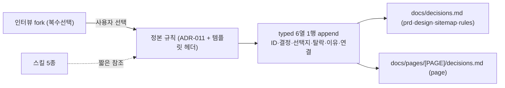

# spec-01-03: 결정 로그 자동 기록 (fork 트리거 + ID 스키마 정본화)

## 📋 메타

| 항목 | 값 |
|---|---|
| **Spec ID** | `spec-01-03` |
| **Phase** | `phase-01` |
| **Branch** | `spec-01-03-decision-log-auto` |
| **상태** | Planning |
| **타입** | Feature (결정 로그 스키마 확정 + 정본 규칙 + 인터뷰 스킬 참조 삽입) |
| **Integration Test Required** | no |
| **작성일** | 2026-06-04 |
| **소유자** | evan |

> critique(B+C) 반영본. 변경 요지: (A) 5개 스킬 규칙 중복 → 정본 1곳 + 짧은 참조, (C) typed 표에 **ID·연결 열 + supersede + 이유 미입력 처리** 스키마 확정.

## 📋 배경 및 문제 정의

### 현재 상황
spec-01-01 이 결정 로그 2층(`docs/decisions.md` 전역 + `docs/pages/[PAGE]/decisions.md` 페이지) 템플릿을 깔았고, spec-01-02 의 `/gd-plan-page` 가 페이지 `decisions.md` **골격(행0)** 을 만든다. 그러나 **무엇이 한 행이 되는지**(트리거)와 **행이 어떤 모양인지**(ID·연결)가 없어 결정 로그가 비어 있고, 적힌다 해도 spec-1-04 set-diff 가 파싱할 키가 없다.

### 문제점
1. 인터뷰/픽의 *결정 이유*가 휘발된다 — 골격만 있고 채우는 규칙이 없다.
2. **★ 치명**: 현 4열 표(`결정|선택지|탈락|이유`)에 **결정 ID·연결([CAP]/[PAGE]) 열이 없다**. ADR-008 목표가 "role→CAP→PAGE→FLOW 기계가독"인데 결정 1행이 어느 capability/page 에 매이는지 표현 불가 → spec-1-04 set-diff(누수 B 전파 검증)의 토대가 무너진다.
3. 결정이 *바뀔* 때(재픽) 처리 미정 — 무시=박제 / 덮어쓰기=이력 소실.
4. 규칙이 5개 스킬에 **중복 삽입**(안 A) → 한 곳 고치면 5곳 drift (DRY 위반).
5. 경로 불일치 — `templates/decisions.md` 주석이 `pages/[PAGE]/`(docs/ 누락). 실제 출력은 `docs/pages/`.

### 해결 방안 (요약 — B+C)
- **C (스키마 확정)**: typed 표를 **6열** `ID | 결정 | 선택지 | 탈락 | 이유 | 연결` 로 확장. 순차 ID(`D-01…`, 파일별 독립) + 연결 셀에 `[CAP-..]`/`[PAGE-..]` + supersede(append+inline status, 불변) + 이유 미입력 처리(1회 되묻기→`<!-- TODO -->`) + 동일키 멱등 정의.
- **B (정본화)**: 트리거·스키마·supersede·멱등 규칙을 **단일 정본**(ADR-011 + `decisions.md` 템플릿 규칙 블록)에 둔다. 인터뷰 스킬 5종(prd·design·sitemap·page·rules)은 **짧은 참조 한 줄 + 자기 fork 목록**만 갖는다(규칙 본문 중복 금지).
- 경로 `docs/pages/` 통일.

## 📊 개념도

## 🎯 요구사항

### Functional Requirements

**FR1 — typed 6열 스키마 (정본: 템플릿 규칙 블록 + ADR-011)**
fork(복수선택)에서 사용자가 하나를 고른 순간, 해당 decisions.md 에 **typed 1행** append:

| 열 | 의미 | 규칙 |
|---|---|---|
| `ID` | 결정 식별자 | `D-01`부터 파일별 순차. 한 번 부여 후 불변. |
| `결정` | 무엇을 정했나 | 멱등 키. 동일 텍스트 재등장 시 재기록 안 함(FR4). |
| `선택지` | 제시된 fork 후보 | — |
| `탈락` | 안 고른 후보 | — |
| `이유` | 왜 골랐나 | 미입력 처리 FR3. 트랜스크립트 금지. |
| `연결` | 매이는 대상 | 전역=`[CAP-..]`, 페이지=`[PAGE-..]`/섹션. 없으면 `-`. set-diff 키. |

**FR2 — 자동 기록 대상 스킬 + 위치** (규칙 본문 없이 *참조 + fork 목록*만 삽입)
| 스킬 | 기록 위치 | 자동 기록되는 fork |
|---|---|---|
| `gd-plan-prd` | `docs/decisions.md` | Out-of-scope·톤·access 등 전역 결정 |
| `gd-plan-design` | `docs/decisions.md` | 픽 + 탈락 후보 |
| `gd-plan-sitemap` | `docs/decisions.md` | 페이지 묶기 결정 |
| `gd-plan-page` | `docs/pages/[PAGE-<slug>]/decisions.md` | 섹션·layout·modal 결정 |
| `gd-plan-rules` | `docs/decisions.md` | 수치·인터랙션 선택 |

**FR3 — 이유 미입력 처리 + 수동 보강 (page·prd 한정)**
- 이유 미입력: fork 만 고르고 이유를 안 주면 → 에이전트가 **1회 되묻기** → 그래도 없으면 `이유` 셀에 `<!-- TODO: 이유 -->` 로 채우고 행은 남긴다(행 누락 금지).
- 수동 보강: fork 밖 중요한 일회성 결정은 에이전트가 "이건 남길까요?" 제안 후 기록(강제 아님). **`gd-plan-page` 와 `gd-plan-prd` 에서만** — design/sitemap/rules 는 자동(fork)만(과잉 방지).

**FR4 — supersede + 멱등**
- `decisions.md` 없으면 템플릿 기반 생성 후 append.
- **멱등 키 = `결정` 열 텍스트**. 동일 결정이 이미 있으면 재기록 안 함.
- **supersede(재방문)**: 결정 *값이 뒤집히면* 새 행 append(새 ID). 옛 행은 **삭제 금지** — ID 셀을 `~~D-01~~`, `연결` 셀 끝에 `→D-05` 표기(append+inline status, 불변). 정본 규칙은 ADR-011.

### Non-Functional Requirements
1. 멱등 · 한국어 · 트랜스크립트 금지(typed only).
2. 기존 스킬 동작 회귀 없음. 본문 길이 cap(기본 400) 준수 — 정본화로 스킬당 증가분 최소(참조 1~2줄).
3. `flows`/`review` 불변(본 spec 범위 밖).
4. 규칙 **DRY**: 트리거·스키마·supersede 본문은 정본(ADR-011 + 템플릿 헤더) 1곳에만. 스킬은 참조.

## 🚫 Out of Scope
- flows 자동 역참조 + `rules`/`review` 경로·BLOCK 정상화 → **spec-1-04**.
- 결정 로그의 기계 파싱·검증(set-diff) → spec-1-04(review). 본 spec 은 *파싱 가능한 스키마*까지만 보장하고 검증기는 안 만든다.
- 정본 규칙 블록 형식(열 개수/ID 패턴)의 **정규식 강제 검증** → 가능하면 본 spec templates-v2 에 넣되, 어려우면 spec-1-04 로 이월(테스트 한계 §DoD).
- `gd-plan-start`/`gd-plan-flows` 결정 기록 → 불필요(생성 단계 아님/여정 정의).

## 📑 ADR 후보 (Architecture Decision Records)
- [x] ADR 가치 있는 결정 있음:
  - **ADR-011 `decision-log-auto-trigger`** (type: **convention**) — 결정 로그의 *정본*. 포함: (a) 트리거(fork 자동 + page·prd 수동 보강), (b) typed **6열 스키마 + 순차 ID + 연결([CAP]/[PAGE]) 열**, (c) supersede 정책(append+inline status, 불변), (d) 동일키 멱등 정의, (e) 이유 미입력 처리, (f) 정본 위치 선언. ADR-008(2층·typed)의 *형식을 확장*하므로 별도 ADR 대신 011 에 흡수(형식과 채우는 법은 불가분).

## 🔗 관련 문서 (Related)
- 관련 ADR: `docs/decisions/ADR-008-decision-log-two-tier.md`(2층·ID 스파인), 신규 `ADR-011`
- 관련 spec: spec-01-01(템플릿), spec-01-02(page 골격), spec-1-04(set-diff 소비자)
- critique: `specs/spec-01-03-decision-log-auto/critique.md`(B+C 권장)

## ✅ Definition of Done
- [ ] 모든 단위 테스트 PASS (`pnpm test`) + `pnpm typecheck`
- [ ] ADR-011 작성(정본) + 템플릿 2종(`templates/decisions.md`·`templates/pages/decisions.md`) 6열 스키마 + 규칙 블록 + 경로 `docs/pages/` 통일
- [ ] 인터뷰 스킬 5종에 **짧은 참조 + fork 목록** 삽입(규칙 본문 중복 없음), page·prd 에 수동 보강 한 줄
- [ ] `walkthrough.md` 와 `pr_description.md` 작성 및 ship commit
- [ ] `spec-01-03-decision-log-auto` 브랜치 push 완료
- [ ] 사용자 검토 요청 알림 완료

### 🧪 테스트 신뢰 한계 (명시)
- 단위 테스트는 **스킬 본문에 참조 문자열이 존재하는지 + 템플릿 헤더가 6열(ID·연결 포함)인지** 만 검증한다.
- gd-plan 스킬은 markdown 지시문이므로 **실제 인터뷰에서 1행이 생성되는지는 단위 테스트로 검증 불가** — 지시문 순응에 의존한다. 결정적 검증은 spec-1-04 의 review set-diff 소관.
