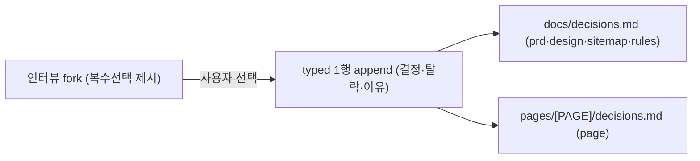

# spec-01-03: 결정 로그 자동 기록 (fork 트리거)

## 📋 메타

| 항목 | 값 |
|---|---|
| **Spec ID** | `spec-01-03` |
| **Phase** | `phase-01` |
| **Branch** | `spec-01-03-decision-log-auto` |
| **상태** | Planning |
| **타입** | Feature (인터뷰 스킬에 결정 기록 규칙 삽입) |
| **Integration Test Required** | no |
| **작성일** | 2026-06-04 |
| **소유자** | evan |

## 📋 배경 및 문제 정의

### 현재 상황
spec-01-01 이 결정 로그 2층(`docs/decisions.md` 전역 + `pages/[PAGE]/decisions.md` 페이지) 템플릿을 깔았고, spec-01-02 의 `/gd-plan-page` 가 페이지 `decisions.md` **골격(행0)** 을 만든다. 그러나 **무엇이 한 행이 되는지**(트리거)가 스킬에 없어 결정 로그가 비어 있다.

### 문제점
인터뷰/픽의 *결정 이유*가 여전히 휘발된다 — 골격만 있고 채우는 규칙이 없다. "목적 표류"를 대조할 원본이 안 쌓인다.

### 해결 방안 (요약)
gd-plan 스킬은 markdown 지시문이므로, 인터뷰 스킬(prd·design·sitemap·page·rules)에 **"fork(복수선택) 결정 → decisions.md typed 1행" 규칙**을 심는다. 전역 결정은 `docs/decisions.md`, 페이지 결정은 `pages/[PAGE]/decisions.md`. fork 밖 중요 결정은 수동 보강(grill 합의 "3번: 자동+수동").

## 📊 개념도

## 🎯 요구사항

### Functional Requirements
1. **공통 "결정 기록 규칙"** — 인터뷰가 복수선택(fork)을 제시하고 사용자가 하나를 고른 순간, 해당 decisions.md 에 **typed 1행** append: `| 결정 | 선택지 | 탈락 | 이유 |`. **트랜스크립트(대화 받아쓰기) 금지** — 무엇을 정했나 + 탈락지 + 이유만.
2. **대상 스킬 + 기록 위치**:
   - `gd-plan-prd` → `docs/decisions.md` (Out-of-scope·톤·access 등 전역 결정)
   - `gd-plan-design` → `docs/decisions.md` (픽 + 탈락 후보 이유)
   - `gd-plan-sitemap` → `docs/decisions.md` (페이지 묶기 결정)
   - `gd-plan-page` → `docs/pages/[PAGE-<slug>]/decisions.md` (섹션·layout·modal 결정)
   - `gd-plan-rules` → `docs/decisions.md` (수치·인터랙션 선택)
3. **수동 보강** — fork 밖에서 내려진 중요한 일회성 결정은 에이전트가 "이건 남길까요?" 제안 후 기록 (강제 아님).
4. **멱등** — `decisions.md` 없으면 템플릿 기반 생성 후 append. 같은 결정(동일 "결정" 키)이 이미 있으면 재기록 안 함.

### Non-Functional Requirements
1. 멱등 · 한국어 · 트랜스크립트 금지(typed only).
2. 기존 스킬 동작 회귀 없음. 본문 길이 cap(기본 400) 준수.
3. `flows`/`review` 불변(본 spec 범위 밖).

## 🚫 Out of Scope
- flows 자동 역참조 + `rules`/`review` 경로·BLOCK 정상화 → **spec-1-04**.
- 결정 로그의 기계 파싱·검증(set-diff) → spec-1-04(review) 이후.
- `gd-plan-start`/`gd-plan-flows` 에 결정 기록 추가 → 불필요(생성 단계 아님/여정 정의).

## 📑 ADR 후보 (Architecture Decision Records)
- [x] ADR 가치 있는 결정 있음:
  - `decision-log-auto-trigger` (type: **convention**) — "인터뷰 fork 선택 = 자동 1행 + 수동 보강" 트리거 규칙. ADR-008(2층·typed)의 *채우는 방법*을 확정. 모든 인터뷰 스킬이 따르는 장기 컨벤션.

## 🔗 관련 문서 (Related)
- 관련 ADR: `docs/decisions/ADR-008-decision-log-two-tier.md`(2층 형식), 신규 ADR-011
- 관련 spec: spec-01-01(템플릿), spec-01-02(page 골격)

## ✅ Definition of Done
- [ ] 모든 단위 테스트 PASS (`pnpm test`) + `pnpm typecheck`
- [ ] 인터뷰 스킬 5종(prd·design·sitemap·page·rules)에 결정 기록 규칙 삽입 + ADR-011
- [ ] `walkthrough.md` 와 `pr_description.md` 작성 및 ship commit
- [ ] `spec-01-03-decision-log-auto` 브랜치 push 완료
- [ ] 사용자 검토 요청 알림 완료
