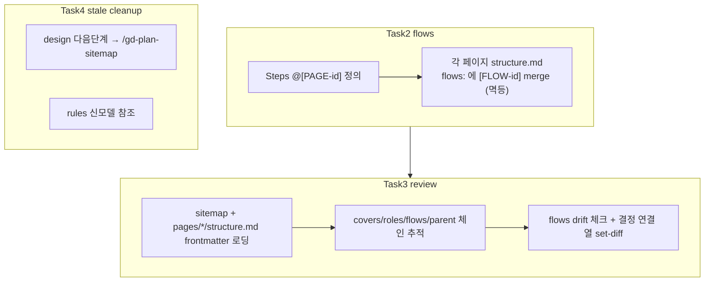

# Implementation Plan: spec-01-04

## 📋 Branch Strategy

- 신규 브랜치: `spec-01-04-flows-autoref-review` (브랜치 이름 = spec 디렉토리 이름, `feature/` prefix 없음)
- 시작 지점: `phase-01-gd-plan-vertical-slice` (phase base 모드 — Spec PR 은 phase base 로 머지)
- 첫 task 가 브랜치 생성을 수행함

## 🛑 사용자 검토 필요 (User Review Required)

> 본 Plan 을 Accept 하기 전에 사용자가 명시적으로 확인해야 할 항목들.

> [!IMPORTANT]
> - [ ] **FR1 = full re-derive**(critique 반영): 매 실행마다 flow 전수 스캔으로 페이지 `flows:` 를 통째 재계산·덮어쓰기(추가만 아님). SoT = flow steps, 페이지 `flows:` = 파생(손편집 금지) → ADR-012(invariant), ADR-010 의 예외로 명문화.
> - [ ] **누수 판정 = LLM 무결성 점검**(set-diff 아님): 결정적 CLI lint(`gd-cli lint` 종료코드)는 review §7 v2 로 유지 — 이번엔 코드 엔진 안 만든다.

> [!WARNING]
> - [ ] **죽은 평면 템플릿 `templates/structure.md`**: 신모델 전환으로 사실상 미사용이나 `skills.test.ts:74` 가 존재를 강제. 본 spec 에서 **제거 안 함**(out of scope). 제거하려면 테스트 동반 수정이 필요 → 별도 phase-FF/spec 권장. (이 항목 동의 = 그대로 둠)
> - [ ] **review 길이**: §1/§2 확장으로 600줄 cap 근접 가능 — 초과 시 표현 압축으로 대응(기능 축소 아님).

## 🎯 핵심 전략 (Core Strategy)

### 아키텍처 컨텍스트



### 주요 결정

| 컴포넌트 | 전략 | 이유 |
|:---:|:---|:---|
| **flows 역참조** | flow steps → page `flows:` **full re-derive**(전수 스캔 재계산 덮어쓰기, ID 사전순 정렬, FLOW slug ADR-009 정규화) | drift 0, GC·정렬·멱등 한 번에. add-only 의 stale 누적·손편집 모순 회피(critique #1) |
| **review 입력** | 구 `docs/structure.md` → `sitemap.md` + `pages/*/structure.md` frontmatter | spec-01-01/02 신모델 정합. frontmatter = ID 스파인(ADR-008) |
| **누수 판정** | LLM 수준 **무결성 점검**(연결 열·ID 체인 읽고 BLOCK/WARN, 정렬 출력+근거 인용) | 결정적 set-diff 엔진은 v2(review §7). 도구가 markdown 지시문이라 지금은 지시문이 적정. "set-diff"=결정적 보장 아님 표기(critique #5) |
| **검증** | `skills.test.ts` 에 신모델 참조·자동역참조 지시문 assert 추가(start 선례) | 단위 테스트가 검증 가능한 최대 — 본문 문자열·구조 |

### 📑 ADR 후보

- [x] ADR 가치 있는 결정 있음 → 후보 한 줄 요약: `flows-reverse-derivation` (type: **invariant**) → `ADR-012` (Task 5 에서 작성). **ADR-010 의 두 번째 인스턴스 + `flows` 필드 SoT 예외 명문화 포함**(critique #2).
- [ ] 없음

## 📂 Proposed Changes

### flows (FR1, FR2)

#### [MODIFY] `plans/gd-plan-flows.md`
- §1 로딩 표: `docs/structure.md` → `docs/sitemap.md`(로스터의 `[PAGE-id]`) + `docs/pages/[PAGE-id]/structure.md`(페이지 frontmatter).
- §3/신규 §: **자동 역참조 단계(full re-derive)** 추가 — Steps 확정 후 **전체 flow 스캔** → 각 `@[PAGE-id]` 의 `docs/pages/[PAGE-id]/structure.md` `flows:` 를 `sort({[FLOW-slug] | 그 page 참조 flow})` 로 **통째 재계산·덮어쓰기**(추가만 아님, 빠진 참조 옛 항목 자동 제거). ID 사전순 정렬, FLOW slug ADR-009 정규화. "flow steps = 단일 원천, page flows = 파생(손편집 금지)" 명문화 + ADR-012 참조.
- §3/§7: "structure.md sitemap 에 존재" → "sitemap.md 로스터에 존재".

#### [MODIFY] `templates/flows/_name.md`
- §Steps 규칙: "structure.md sitemap 에 존재" → "sitemap.md 로스터에 존재".

#### [MODIFY] `templates/pages/structure.md` (critique #3)
- frontmatter 주석 line 5: `flows: []` 설명의 "(→ ADR-009 예정)" → "(→ ADR-012)". (ADR-009 는 slug 정규화로 점유됨 — 약속-구현 drift 정정.)

### review (FR2, FR4, FR5)

#### [MODIFY] `plans/gd-plan-review.md`
- §1 로딩 표: `docs/structure.md` → `docs/sitemap.md` + `docs/pages/*/structure.md`(frontmatter `covers/roles/flows/parent`) + `docs/decisions.md`·`docs/pages/*/decisions.md`(6열 `연결`).
- §2 체크리스트: ID 체인을 frontmatter 로 추적하도록 표현 갱신 + **신규 structural 체크 2건**:
  - 페이지 `flows:` ↔ flow step `@[PAGE-id]` drift (역참조 불일치) → BLOCK.
  - decisions `연결`=`[CAP]/[PAGE]` 가 모델에 부재(누수) → BLOCK.
- 누수 점검 출력은 **정렬된 ID 리스트 + 근거 파일:줄 인용**(재현성). "set-diff"=결정적 보장 아닌 LLM 무결성 점검임을 명시(critique #5). "structure.md sitemap" → "sitemap.md".

### stale cleanup (FR2, FR3)

#### [MODIFY] `plans/gd-plan-design.md`
- §종료 출력 "다음 단계: `/gd-plan-structure`" → "`/gd-plan-sitemap`".

#### [MODIFY] `plans/gd-plan-rules.md`
- §1 로딩 `docs/structure.md` → `docs/pages/*/structure.md`(화면 종류).

### ADR (Task 5)

#### [NEW] `docs/decisions/ADR-012-flows-reverse-derivation.md`
- type: invariant. 페이지 `flows:` 는 flow step 에서 **재계산 파생**, 손편집 금지. 단일 원천 = flow step `@[PAGE-id]`.
- **ADR-010 관계 명문화**(critique #2): ADR-010 의 두 번째 인스턴스이며, "page frontmatter 단일 작성자(`/gd-plan-page`)" 가정을 `flows` 필드에 한해 `/gd-plan-flows` SoT 로 좁히는 예외임을 본문에 기술.

### 테스트 (각 Task 의 Red)

#### [MODIFY] `__tests__/skills.test.ts`
- flows/review/rules: `docs/structure.md` **미포함** + `sitemap.md`/`pages/` 포함 assert.
- flows: 자동 역참조 지시문 존재(예: "flows:" + "도출"/"파생" 키워드, ADR-012 참조) assert.
- design: "다음 단계: /gd-plan-sitemap" 포함 + "/gd-plan-structure" 미포함 assert.
- review: frontmatter ID(`covers`/`flows`/`parent`) + `연결` 소비 지시문 존재 assert.

## 🧪 검증 계획 (Verification Plan)

### 단위 테스트 (필수)
```bash
pnpm test
pnpm typecheck
```

### 통합 테스트 (Integration Test Required = no)
- 생략. end-to-end(미용실 예약 파이프라인 실제 실행)는 phase 통합 테스트(`/hk-phase-ship`) 소관.

### 수동 검증 시나리오
1. `pnpm test` → skills.test.ts 신규 assert 포함 전부 PASS — 기대: flows/review/rules 에 `docs/structure.md` 0건.
2. `grep -rn "docs/structure.md\|/gd-plan-structure" plans/ templates/` → 기대: 0건(평면 잔재 제거 확인).
3. (개념 검증) flows 스킬 본문에 "각 `@[PAGE-id]` 의 structure.md `flows:` 에 merge" 지시문 존재 육안 확인.

## 🔁 Rollback Plan

- 스킬/템플릿 markdown + 테스트 변경뿐 — 코드 런타임 영향 없음. 문제 시 해당 commit `git revert`.
- 상태/데이터 영향 없음(생성물 docs/ 는 사용자 런타임 산출, repo 미포함).

## 📦 Deliverables 체크

- [ ] task.md 작성 (다음 단계)
- [ ] 사용자 Plan Accept 받음
- [ ] (실행 후) 모든 task 완료
- [ ] (실행 후) walkthrough.md / pr_description.md ship
