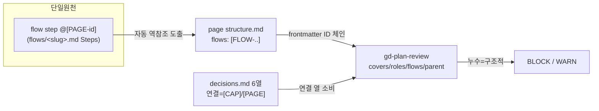

# spec-01-04: flows 자동 역참조 + frontmatter ID 체인 + review 신모델 갱신

## 📋 메타

| 항목 | 값 |
|---|---|
| **Spec ID** | `spec-01-04` |
| **Phase** | `phase-01` |
| **Branch** | `spec-01-04-flows-autoref-review` |
| **상태** | Planning |
| **타입** | Feature |
| **Integration Test Required** | no |
| **작성일** | 2026-06-06 |
| **소유자** | evan |

## 📋 배경 및 문제 정의

### 현재 상황

spec-01-01~03 이 세로 슬라이스 모델(`sitemap.md` 로스터 + `pages/[PAGE]/{structure,decisions}.md` + 2층 결정 로그)을 깔고, page 스킬·템플릿까지 신모델로 옮겼다. 그러나 **파이프라인 마지막 두 스킬(`flows`, `review`)이 여전히 구 평면 모델을 참조**한다.

- `templates/pages/structure.md` frontmatter 는 이미 `flows: []` + 주석 "`/gd-plan-flows` 가 flow step `@[PAGE-id]` 에서 자동 도출 — 손편집 금지" 를 **선언**해 둠.
- `gd-plan-page` §4 도 "`flows: []`(빈 배열 — flows 가 자동 도출, spec-1-04)" 라고 약속함.
- 그런데 **정작 `gd-plan-flows` 스킬은 그 back-fill 을 수행하지 않는다.** flow step 을 정의해도 페이지 `flows:` 는 영원히 `[]` 로 남는다.

### 문제점

1. **약속된 자동 역참조 미구현**: 페이지 `flows:` 가 채워지지 않아 성공 기준 4번(frontmatter `flows` ↔ flow step `@[PAGE-id]` 1:1, 손편집 0)을 못 채운다.
2. **stale 평면 참조** (grep 확인):
   - `plans/gd-plan-flows.md:18,38` — `docs/structure.md` / "structure.md sitemap" (신모델은 `docs/sitemap.md` 로스터 + `docs/pages/*/structure.md`)
   - `plans/gd-plan-review.md:20,35` — `docs/structure.md`
   - `plans/gd-plan-rules.md:18` — `docs/structure.md`
   - `plans/gd-plan-design.md:70` — "다음 단계: `/gd-plan-structure`" (**없어진 명령**, spec-01-02 에서 sitemap/page 로 분리됨 → 파이프라인이 끊김)
   - `templates/flows/_name.md:16` — "structure.md sitemap"
3. **review 가 ID 스파인을 안 읽음**: `gd-plan-review` 가 frontmatter `covers/roles/flows/parent` 기계가독 체인을 소비하지 않고, spec-01-03 이 깐 결정 로그 6열의 `연결` 열도 소비하지 않는다 → "누수(빠진 연결)" 를 기계적으로 못 잡는다.

### 해결 방안 (요약)

`gd-plan-flows` 에 **자동 역참조 단계**(flow steps = 단일 원천 → 각 참조 페이지 `structure.md` 의 `flows:` 에 `[FLOW-id]` merge, 멱등, drift 0)를 추가하고, `flows·review·rules·design` 스킬과 `flows/_name.md` 템플릿의 **구 평면 참조를 신모델로 정상화**한다. `gd-plan-review` 가 frontmatter ID 체인 + 결정 로그 `연결` 열을 읽어 누수를 판정(LLM 수준 set-diff)하도록 갱신한다. 결정적 CLI 강제(set-diff lint)는 review §7 대로 v2 로 유지.

## 📊 개념도

## 🎯 요구사항

### Functional Requirements

1. **FR1 — flows 자동 역참조 (full re-derive)**: `gd-plan-flows` 가 Steps 확정 후, **전체 flow 파일을 스캔**해 각 페이지 `docs/pages/[PAGE-id]/structure.md` 의 `flows:` frontmatter 를 `flows(page) = sort({ [FLOW-slug] | 그 page 를 step 으로 참조하는 모든 flow })` 로 **통째 재계산하여 덮어쓴다**. 즉 "추가만(add-only)" 이 아니라 매번 정규형으로 재계산 → 빠진 참조의 옛 항목도 자동 제거(GC). flow steps 가 **단일 원천**, 페이지 `flows:` 는 **파생**(손편집 금지). 정렬은 ID 사전순 고정 → 멱등이 집합·텍스트 양쪽에서 성립, drift 0. FLOW slug 도 ADR-009 kebab 정규화를 적용한다(`[FLOW-Booking]`≠`[FLOW-booking]` 변이가 역참조/검증을 깨뜨리지 않도록).
2. **FR2 — 신모델 참조 정상화**: `flows`·`review`·`rules` 스킬과 `flows/_name.md` 템플릿의 `docs/structure.md`(평면) 참조를 `docs/sitemap.md`(로스터) + `docs/pages/[PAGE]/structure.md`(페이지)로 교체.
3. **FR3 — design 파이프라인 복구**: `gd-plan-design` 의 "다음 단계: `/gd-plan-structure`" → "`/gd-plan-sitemap`" 으로 정정(없어진 명령 참조 제거).
4. **FR4 — review frontmatter ID 체인 소비**: `gd-plan-review` §1 로딩을 신모델(sitemap + pages/*/structure.md frontmatter)로 바꾸고, §2 체크가 `covers/roles/flows/parent` 기계가독 ID 로 연결을 추적. **페이지 `flows:` ↔ flow step `@[PAGE-id]` 불일치(drift)** 를 structural 체크로 추가.
5. **FR5 — review 결정 로그 연결 열 무결성 점검 (LLM 수준)**: `decisions.md` 6열의 `연결` 셀이 가리키는 `[CAP]`/`[PAGE]` 가 모델에 실재하는지 검사 → 없으면 structural BLOCK(누수 검출). **출력은 정렬된 ID 리스트로 고정 + 근거 파일:줄 인용 강제**(LLM 판정의 재현성 보강). 본 점검은 결정적 보장이 아니라 **LLM 순응 기반** — 결정적 set-diff CLI enforce(`gd-cli lint` 종료코드)는 v2(review §7)로 유지한다. (그래서 본 spec 에서는 "set-diff" 대신 "무결성 점검" 으로 표기.)

### Non-Functional Requirements

1. 기존 `__tests__` 회귀 PASS + 신규 단위 테스트(스킬 본문 신모델 참조·자동역참조 지시문) PASS, `pnpm typecheck` 0 error.
2. `gd-plan-review` 길이 cap 600줄 유지(`skills.test.ts` 예외), 그 외 스킬 400줄 이하 유지.
3. gd-plan 은 markdown 지시문 도구 — 본 spec 의 단위 테스트는 **스킬/템플릿 본문(참조 문자열·지시문 존재)** 만 검증한다. 실제 frontmatter 1행 생성·누수 판정의 end-to-end 는 phase 통합 테스트(미용실 예약, 수동) 소관.

## 🚫 Out of Scope

- 결정적 set-diff lint 엔진(`gd-cli lint` 종료코드 강제) — review §7 v2 백로그.
- wording/completeness 체크, 문서 staleness 전파 — v2.
- 죽은 평면 템플릿 `templates/structure.md`(구 `/gd-plan-structure` 용) 제거 — `skills.test.ts:74` 가 존재를 강제하므로 별도 결정 필요(plan 의 User Review 항목 참조). 본 spec 에서는 건드리지 않음.
- `src/build-index.ts`·`cli.ts` 코드 변경 — 본 spec 은 스킬/템플릿 지시문 레이어.
- design-md collection 구조 변경.

## 📑 ADR 후보

- [x] ADR 가치 있는 결정 있음 → 후보 한 줄 요약: `flows-reverse-derivation` (type: **invariant**)
  - "페이지 `flows:` 는 **항상** flow step `@[PAGE-id]` 에서 재계산 파생되며 손편집하지 않는다. 단일 원천 = flow step." cross-spec(성공기준 4·review drift 체크가 의존), long-lived → invariant. 번호 `ADR-012`.
  - **ADR-010 과의 관계 명문화 필수**(critique #2): 본 invariant 는 ADR-010("디렉토리=진실, 인덱스=파생")의 *두 번째 인스턴스*이며, ADR-010 의 "page frontmatter 는 `/gd-plan-page` 단일 작성자" 가정을 **`flows` 필드에 한해 `/gd-plan-flows` 가 SoT 작성자**로 좁히는 예외다. ADR-012 본문에 이 두 점을 적는다.
- [ ] 없음

## 🔍 Critique 결과

Opus 독립 비판 (전체: `specs/spec-01-04-flows-autoref-review/critique.md`). 권장안 = **현재 spec 유지 + 대안 A(full re-derive) 흡수**. 반영 5건:
1. FR1 "merge" → **full re-derive**(재계산 덮어쓰기) — GC/정렬/멱등/"손편집 금지↔수정주체" 모순 동시 해소.
2. ADR-012 가 **ADR-010 과의 관계**(두 번째 인스턴스 + flows 필드 SoT 예외) 명문화.
3. `templates/pages/structure.md:5` 주석 "ADR-009 예정" → **"ADR-012"** 정정(약속-구현 drift, plan/task 에 작업 추가).
4. **FLOW slug ADR-009 정규화** 적용(set-diff 안정성).
5. review "set-diff" → **"무결성 점검"** 표현 정직화 + 재현성 보강.

## 🔗 관련 문서 (Related)

- 관련 ADR: `docs/decisions/ADR-006-vertical-slice-page-unit.md`, `docs/decisions/ADR-007-sitemap-as-map.md`, `docs/decisions/ADR-008-decision-log-two-tier.md`, `docs/decisions/ADR-010-sitemap-pages-single-source.md`, `docs/decisions/ADR-011-decision-log-auto-trigger.md`
- 관련 spec: spec-01-01(템플릿/frontmatter 스키마), spec-01-02(sitemap/page 명령), spec-01-03(결정 로그 6열 `연결`)
- 직전 walkthrough 이월: `specs/spec-01-03-decision-log-auto/walkthrough.md` (🚧 이월 항목)

## ✅ Definition of Done

- [ ] 모든 단위 테스트 PASS (`pnpm test`) + `pnpm typecheck` 0 error
- [ ] (Integration Test Required = no → 생략)
- [ ] `walkthrough.md` 와 `pr_description.md` 작성 및 ship commit
- [ ] `spec-01-04-flows-autoref-review` 브랜치 push 완료
- [ ] 사용자 검토 요청 알림 완료
