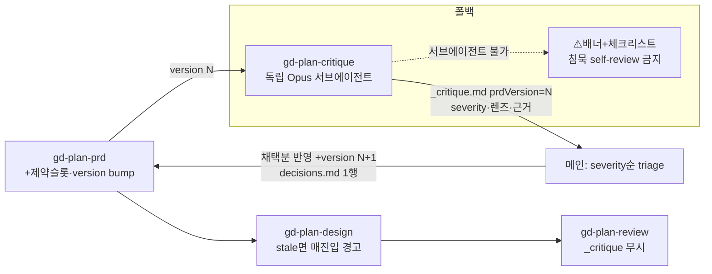

# Implementation Plan: spec-01-05

## 📋 Branch Strategy

- 신규 브랜치: `spec-01-05-prd-critique` (브랜치 이름 = spec 디렉토리 이름, `feature/` prefix 없음)
- 시작 지점: phase base `phase-01-gd-plan-vertical-slice`
- 첫 task 가 브랜치 생성을 수행함

## 🛑 사용자 검토 필요 (User Review Required)

> [!IMPORTANT]
> - [ ] **critique 는 soft gate** — `gd-plan-design` 진입 시 경고만, BLOCK 아님. (review 와 달리 판정이 결정적이지 않음)
> - [ ] **#12 결정**: 서브에이전트 불가 시 멈추지 않고 **정직한 폴백**(배너+체크리스트). 침묵 self-review 절대 금지.
> - [ ] **#13 결정**: prd `version` frontmatter 유지.

> [!WARNING]
> - [ ] **기존 스킬 3종 수정**(`gd-plan-prd`·`gd-plan-design`·`gd-plan-start`) + `gd-plan-review`(_critique 무시) — 회귀 테스트로 보호.
> - [ ] **prd `version` 손편집 desync 감수** — 사용자가 스킬 밖에서 prd 수정 시 version 미반영(설계상 수용).
> - [ ] **가치-recall 테스트(§G)는 CI 자동 assert 아님** — LLM 서브에이전트 실행이라 fixture+기대목록은 커밋·스키마검증하되 recall 판정은 수동/주기 eval.
> - [ ] **디자인층 critique 는 본 spec 범위 밖**(별도 후속).

## 🎯 핵심 전략 (Core Strategy)

### 아키텍처 컨텍스트



### 주요 결정

| 컴포넌트 | 전략 | 이유 |
|:---:|:---|:---|
| **검증 2층** | critique(의미)=별도 커맨드 / review(구조)=유지 | "구조적 완성 ≠ 의미적 정합" — 섞으면 북극성 흐려짐 |
| **독립성** | 독립 컨텍스트 우선 + 정직한 폴백(§F) | 침묵 self-review 차단(불변식). 멈춤 대신 폴백으로 가용성 확보 |
| **L2 grounding** | 1차=선언된 제약슬롯 / 2차=웹 best-effort | LLM 이 모든 법 알 필요 X(도메인 의존). prevention↔detection 맞물림 |
| **staleness** | prd `version` ↔ `_critique.prdVersion`, 읽을 때 파생 | stateless — "1회 경고" 영속플래그 모순 회피 |
| **반영** | 보고서만 산출 → 사람 severity순 채택 → prd 반영 | prd 저작권 보존(서브에이전트가 직접 수정 X) |
| **테스트** | 스키마(자동) + 가치-recall fixture(수동 eval) 분리 | 스키마 통과만으론 "결함 잡는가" 무검증 |

### 📑 ADR 후보

- [x] ADR 가치 있는 결정 있음 → 머지 시 `docs/decisions/ADR-{NNN}-*.md` 작성:
  - `critique-vs-review-separation` (convention)
  - `author-verifier-separation` (invariant — 독립 컨텍스트 우선 + 정직한 degrade)
  - `prd-version-derived-staleness` (convention)

## 📂 Proposed Changes

### 템플릿
#### [MODIFY] `templates/prd.md`
- frontmatter 에 `version: 1` 추가(FR5). `## 제약/규제` 섹션 추가(FR8) — "반드시 따라야 할 규칙(법·보안·도메인)", 리스크와 구분.

### 인터뷰 스킬
#### [MODIFY] `plans/gd-plan-prd.md`
- 제약/규제 질문 1개 추가(기능 정의 *전*). 종료 체크리스트에 `version` bump 추가.

### critique 스킬 (핵심)
#### [NEW] `plans/gd-plan-critique.md`
- 독립 서브에이전트(Opus/general-purpose) 디스패치, 입력=`prd.md`(+decisions)(§A). 3렌즈+tie-break(§C), L1 판정법(§E), L2 grounding(§D), severity 루브릭+`_critique.md` 스키마(§B), 폴백(§F), 위생(§H). 메인 triage→prd 반영+decisions 기록(FR3·4).

### 통합 표면
#### [MODIFY] `plans/gd-plan-design.md`
- 진입 시 `prd.version` vs `_critique.prdVersion` 비교 → 미실행/stale 이면 매 진입 경고(BLOCK 아님, FR6).
#### [MODIFY] `plans/gd-plan-start.md`
- 진행률에 critique 상태(미실행/stale/완료) 표시. auto-load 가 `_critique.md` 무시(FR7).
#### [MODIFY] `plans/gd-plan-review.md`
- auto-load 로스터에서 `_critique.md` 무시 명시(FR7 위생).

### 가치 검증
#### [NEW] `__tests__/fixtures/golden-prd-*.md` + 기대 발견 목록
- 결함 박힌 PRD fixture(예: 치과 4결함) + must-catch 목록(§G). recall eval 토대.

### 문서
#### [MODIFY] `README.md`
- 명령어 목록에 `/gd-plan-critique` 추가(흐름도 prd→critique→design).

## 🧪 검증 계획 (Verification Plan)

### 단위 테스트 (필수)
```bash
pnpm test        # vitest — 기존 회귀 + 신규 스키마 검증
pnpm typecheck
pnpm build       # 설치기 무손상
```
- 신규 스키마 테스트: gd-plan-critique 스킬 구조, prd 템플릿 `version`+`## 제약/규제`, gd-plan-prd 질문 슬롯, 통합 표면 문구, fixture 존재·형식.

### 수동 검증 시나리오
1. 결함 fixture PRD 로 `/gd-plan-critique` 실행 → `_critique.md` 가 must-catch(루프 미완결 등)를 severity 포함 보고. (가치-recall eval)
2. prd 수정 후 `/gd-plan-design` 진입 → stale 경고 노출. critique 재실행 → 경고 해소.
3. 서브에이전트 강제 차단(시뮬) → 멈추지 않고 ⚠️배너+체크리스트 폴백.

## 🔁 Rollback Plan

- 스킬/템플릿 변경은 마크다운 — 브랜치 폐기(`git branch -D`)로 무손상 롤백. 런타임 상태/마이그레이션 없음.
- `version` frontmatter 는 신규 필드라 기존 prd 에 없으면 "1 로 간주" — backward compatible.

## 📦 Deliverables 체크

- [x] task.md 작성 (다음 단계)
- [ ] 사용자 Plan Accept 받음
- [ ] (실행 후) 모든 task 완료
- [ ] (실행 후) walkthrough.md / pr_description.md ship
