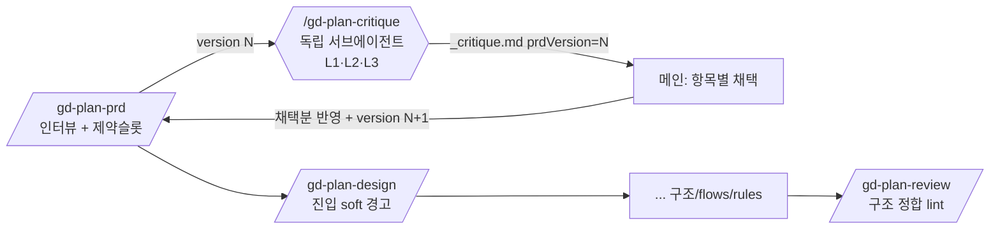

# spec-01-05: PRD 전제 critique (의미 정합 적대 검증) + 제약/규제 prevention

## 📋 메타

| 항목 | 값 |
|---|---|
| **Spec ID** | `spec-01-05` |
| **Phase** | `phase-01` |
| **Branch** | `spec-01-05-prd-critique` |
| **상태** | Planning |
| **타입** | Feature |
| **Integration Test Required** | no |
| **작성일** | 2026-06-09 |
| **소유자** | evan |

## 📋 배경 및 문제 정의

### 현재 상황

gd-plan 의 검증 레이어는 `/gd-plan-review` **하나**다. review 는 *lint(정합성 검사기)* 로, 5종 문서가 `role→capability→page→flow` 로 **연결(syntactic)** 되는지 추적해 끊긴 고리를 BLOCK/WARN 한다. 즉 review 가 보는 것은 **구조적 정합**이다.

gd-plan 의 문서는 인터뷰로 **한 에이전트가 저작**한다. 같은 컨텍스트에서 자기가 쓴 것을 자기가 검토하면 confirmation bias 에 빠진다 — 그리고 그렇게 만든 문서는 **서로 정합적**이므로 review 를 그대로 통과한다.

### 문제점

**구조적 완성 ≠ 의미적 정합.** review 통과가 곧 제품 정합으로 착각된다. 실증(별도 워크스페이스의 치과 예약 사이트 dry-run, 적대적 멀티에이전트 검증)에서 review 를 통과한 문서셋에 다음 결함이 발견됐다:

| 결함 | 층 | review 가 잡나 |
|---|---|---|
| #1 예약 결과 알림을 "Later" 로 분류 → **예약 루프 미완결** (핵심 가치 '전화 없이' 자기모순) | PRD | ❌ 연결은 맞음 |
| #2 이름+연락처만으로 **타인 의료예약 열람** (PIPA 위반) | PRD/보안 | ❌ |
| #3 개인정보처리방침·약관·수집동의 **누락** (PIPA 법정필수) | PRD | ❌ |
| 성공기준 분모(전화예약)가 **시스템 밖 = 측정 불가** | PRD | ❌ |

근본 원인은 하나의 맹점 — "유창함이 정확함을 가렸다(자신감 있고 잘 포맷된 틀린 답)". 방어책은 **만든 자(저작 에이전트)와 검증하는 자(독립 컨텍스트)의 분리**뿐이다. 또한 결함 #2·#3 은 PRD 인터뷰 15문항이 **기능 중심이라 '제약/규제' 질문 슬롯이 없어서** 애초에 입력되지 않은 구멍이다.

### 해결 방안 (요약)

review(구조 정합) 앞에 **`/gd-plan-critique`(의미 정합)** 를 둔다. PRD 전제를 **독립 Opus 서브에이전트**가 적대적으로 비판해 보고서를 내고, 사람이 항목별로 채택해 prd 에 반영한다. 동시에 PRD 인터뷰에 **제약/규제 질문 슬롯**을 추가해 같은 결함을 한 단계 위(prevention)에서 줄인다.

## 📊 개념도

## 🎯 요구사항

### Functional Requirements

1. **신규 `plans/gd-plan-critique.md` 스킬** — PRD 전제를 독립 서브에이전트(Opus, `general-purpose`)로 적대적 비판한다. **독립 컨텍스트 우선**: 서브에이전트를 띄울 수 있으면 반드시 사용. 띄울 수 없으면 **침묵 self-review 금지** — 큰 경고 배너(⚠️ 독립 검증 불가, 자가점검이라 신뢰 낮춤) + 체크리스트 자가점검을 **명시적 폴백**으로 수행(멈추지 않음). → §critique 내부 사양 §F.
2. **3 렌즈로 검사** — **L1** 트랜잭션 완결성·의미 정합(핵심 가치별 루프가 실제로 닫히나), **L2** 도메인 제약·규제 적합성(선언된 제약을 기획이 지켰나), **L3** 검증가능 사실·측정가능성(손계산 가능한 건 계산해 검증, 성공기준이 시스템 내 측정가능한가). 북극성 = "구조적 완성 ≠ 의미적 정합". 렌즈 경계·판정법·grounding 은 §critique 내부 사양.
3. **`docs/_critique.md` 보고서 산출** — frontmatter `prdVersion: N`, 멱등 overwrite. 발견마다 **severity + 렌즈 + 근거(파일:줄) + 제안**(§B 스키마). 서브에이전트는 **보고서만** 작성하고 prd 를 직접 수정하지 않는다.
4. **사람-주도 반영** — 메인 에이전트가 보고서를 읽고 발견 항목을 **severity 순**으로 사용자에게 제시 → **채택분만** prd.md 에 반영 + `docs/decisions.md` 에 typed 1행 기록(연결=`[CAP-..]`).
5. **prd 버전** — prd.md frontmatter 에 `version: N`(monotonic 정수). `/gd-plan-prd`(인터뷰 완료) 와 critique 반영 단계가 **bump**(한 세션의 다건 반영 = +1). stale 판정은 저장하지 않고 **읽을 때** `prd.version` vs `_critique.prdVersion` 를 비교해 파생(stateless). → §E.
6. **soft gate** — `gd-plan-design` 진입 시 version 비교로 critique 미실행/stale 이면 **매 진입 경고**(BLOCK 아님, 그대로 진행 가능). "1회만" 같은 영속 플래그 없음(stateless 원칙 보존).
7. **통합 표면** — `gd-plan-prd` 종료 멘트가 critique 를 다음 단계로 지목 · `gd-plan-start` 진행률에 critique 상태(미실행/stale/완료)를 표시. `gd-plan-start`·`gd-plan-review` auto-load 로스터는 `_critique.md` 를 **무시**(review 가 비판 텍스트를 모델 일부로 오독 방지).
8. **prevention 슬롯** — `gd-plan-prd` 질문 세트 + `templates/prd.md` 에 제약/규제 항목(질문 1개 + `## 제약/규제` 섹션) 추가. 제약은 "그럴 수도 있는 위험(리스크)" 이 아니라 "반드시 따라야 하는 규칙" 으로, 기능 정의 전에 입력된다. **이 슬롯이 L2 의 1차 grounding 소스**(§D).

### Non-Functional Requirements

1. **harness-kit 비의존** — gd-plan 은 배포 패키지다. critique 는 Claude Code 기본 Agent tool 만 사용한다(독립 서브에이전트 = 기본 기능). harness-kit 가 없는 사용자 환경에서도 폴백(§F)으로 동작해야 한다.
2. **멱등성** — 모든 스킬은 재실행 안전. `_critique.md` 는 overwrite(누적 금지).
3. **회귀 무손상 + 가치 검증 테스트** — 기존 `__tests__` PASS + 신규 스킬/템플릿 **스키마 검증**(Red→Green). **추가로**: 스키마 통과만으론 "critique 가 실제로 결함을 잡는가"가 무검증이므로, **결함이 박힌 golden PRD fixture**(예: 치과 4결함) + **기대 must-catch 목록**으로 **recall 테스트**(정확 일치 ❌ / 알려진 핵심결함을 잡았나 ⭕ — LLM 비결정성 허용). → §critique 내부 사양 §G.
4. **degrade 정직성 (불변식)** — 어떤 경우에도 **침묵 self-review 금지**. 독립 컨텍스트 불가 시 반드시 명시 배너로 표지(FR1).
5. **분리의 정직한 한계 명시** — spec·스킬 문서는 "독립 서브에이전트 = 편향 제거"로 **과대주장하지 않는다**. 별도 컨텍스트는 *대화 누적 편향*을 제거하나 **동일 모델(Opus)이라 model-level self-bias 는 잔존**(Panickssery et al., NeurIPS 2024). 이 한계를 명문화 — 과대주장은 review 가 빠진 함정("유창함이 정확함을 가림")의 메타 재발.

## 📐 Critique 내부 사양 (운영 정의 — critique 가 본 spec 자체에서 도출)

> 본 절은 독립 critique(spec-01-05 dogfood)가 짚은 모호함·누락을 해소한 operational 정의다. 결과: `critique.md`.

### §A 서브에이전트 입력 컨텍스트
- 입력 = **`docs/prd.md` 단독** (+ `docs/decisions.md` 참조 허용). critique 는 design/flows *이전*에 돌므로 sitemap/flows 는 입력에 없다.

### §B 보고서 출력 스키마 + severity 루브릭
- severity 4단: **치명**(법적/보안 차단) · **높음**(핵심가치 훼손) · **중간**(보강) · **낮음**(권고).
- `_critique.md`: frontmatter `prdVersion: N` + 렌즈별 섹션. 발견 1줄 = `[severity][렌즈] 요약 — 근거(prd.md:줄) — 제안`.
- triage(FR4)는 severity 내림차순 제시.

### §C 3렌즈 경계 + tie-break
- 한 발견이 복수 렌즈에 걸리면 우선순위: **L2(규제) > L1(의미) > L3(측정)**. (규제는 법적 차단이라 최우선)
- 예: "타인 예약 열람" → L2(보안/규제). "성공기준 분모 측정불가" → L3.

### §D L2 grounding (규제 판정의 사실 출처)
- **1차 ground truth = PRD `## 제약/규제` 슬롯(FR8 선언분)**. L2 는 "*선언된* 제약을 기획이 지켰나"를 판정 — LLM 이 모든 법을 알 필요 없음(도메인 의존).
- **2차(best-effort) = 웹검색** — 알려진 도메인에서 누락된 제약을 surface(예: "병원인데 PIPA 미선언"). 없어도 동작. 환각 규제 금지 — 근거 없으면 "확인 필요"로 표기.

### §E L1 트랜잭션 완결성 operational 판정
- flow 그림 없이: **핵심 가치마다 필요한 end-to-end 사슬을 capabilities + 우선순위(MVP/Later)로 추적**. 사슬의 한 고리가 누락/Later 면 "루프 미완결" 후보.
- 예: 가치=전화 없이 예약 → 사슬 [신청 → 관리자확인 → **결과전달**]. 결과전달(CAP-04)이 Later → 끊김(치명/높음).

### §F degrade 폴백 (FR1·NFR4)
- 서브에이전트 가용 → 사용(Claude Code 기본, 거의 항상).
- 불가 → **침묵 self-review 절대 금지**. 큰 배너 표지 후 §C 렌즈 체크리스트를 메인이 항목별 강제 답변(명시적 폴백 티어). 폴백을 기본으로 오용 금지.

### §G 가치 검증 테스트 (NFR3)
- golden PRD fixture(결함 박힘) + 기대 must-catch 목록. assertion = **recall**(핵심 결함을 잡았나), 정확 일치 아님(LLM 비결정성 허용·코드와 달리 PRD 는 pass/fail 이 fuzzy).
- 스키마 테스트(파일·frontmatter 존재)와 **분리** — 둘 다 필요.

### §H 위생
- `_critique.md` 는 critique 전용 산출물 — review/start 가 무시(FR7).
- prd 에 `<!-- TODO -->` 미완 마커가 있으면 critique 가 경고 후 진행(차단 아님).

## 🚫 Out of Scope

- **디자인층 critique** — design.md·ui-rules 실물 검증(대비비·금지 UI 등)은 별도 spec. design 완료 후 별도 critique 로 다루며 추후 본 critique 와 병합 가능(명명·구조가 이를 허용하도록 둔다).
- **하드 BLOCK 게이트** — critique 판정은 결정적이지 않으므로 review 식 BLOCK 없음(soft 경고만).
- **시장/경쟁 조사 렌즈** · **대안 프레이밍 렌즈** — 목적은 "퍼블리싱 기초 적합성" 이지 시장 검증·제품 방향 탐색이 아님.
- **일반 staleness 전파**(상위>하위 전체) — prd↔critique **한 쌍**만. (gd-plan v2 백로그 항목과 구분)
- **손편집 desync 방어**(내용 해시) — 사용자가 스킬 밖에서 prd 손편집 시 version 미반영은 감수.

## 📑 ADR 후보 (Architecture Decision Records)

- [x] ADR 가치 있는 결정 있음 → 후보:
  - `critique-vs-review-separation` (type: convention) — critique=의미 정합 / review=구조 정합 2층 분리, "구조적 완성 ≠ 의미적 정합"
  - `author-verifier-separation` (type: invariant) — 저작자≠검증자. **독립 컨텍스트 우선 + 정직한 degrade**(침묵 self-review 절대 금지). 단, 분리=컨텍스트 분리이지 모델 분리 아님(한계 명시).
  - `prd-version-derived-staleness` (type: convention) — prd `version` ↔ `_critique.prdVersion`, stale 은 읽을 때 파생(stateless)

## 🔍 Critique 결과 (반영 완료)

`/hk-spec-critique` 독립 Opus 서브에이전트로 본 spec 을 검증(dogfood — 본 spec 이 만들 도구의 원리를 자기 자신에 적용). 전체: `critique.md`. 발견 11건 + 충돌 2건을 사용자와 triage 하여 **전건 반영**:
- **누락 보강**: 입력 범위(§A), severity 루브릭·보고서 스키마(§B), L2 grounding 경로(§D), 가치 검증 테스트 전략(§G), version 멱등·부분채택(FR5).
- **모호 해소**: 3렌즈 tie-break(§C), L1 operational 판정(§E), soft gate stateless("매 진입 경고", FR6), `_critique`↔`_review` 위생(§H).
- **모순 해소(#12)**: "서브에이전트 강제·멈춤" → **독립 컨텍스트 우선 + 정직한 폴백**(FR1·§F). 사용자 의도("침묵 self-review 차단")는 보존, 가용성 모순 제거.
- **정직성(#10)**: "분리 ≠ 모델 분리" 한계 명시(NFR5).
- **YAGNI(#13)**: version machinery 는 사용자 결정으로 **유지**(critique 의 PRD 참조 정확성 토대).
- **ADR 재프레이밍**: `independent-subagent-mandatory` → `author-verifier-separation`.

## 🔗 관련 문서 (Related)

- 관련 wiki: `[[patterns]]` (right-size, drift 재검증)
- 관련 ADR: `[[ADR-012]]` (flows reverse-derivation — review 구조 검증의 토대)
- 실증 근거: 별도 워크스페이스 치과 dry-run 적대적 critique(외부 기록)

## ✅ Definition of Done

- [ ] 모든 단위 테스트 PASS
- [ ] (Integration Test Required = no) 해당 없음
- [ ] `walkthrough.md` 와 `pr_description.md` 작성 및 ship commit
- [ ] `spec-01-05-prd-critique` 브랜치 push 완료
- [ ] 사용자 검토 요청 알림 완료
