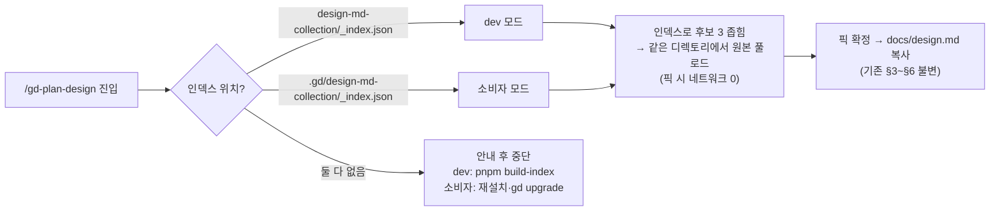

# Implementation Plan: spec-02-01

## 📋 Branch Strategy

- 신규 브랜치: `spec-02-01-dist-artifacts-index` (브랜치 이름 = spec 디렉토리 이름, `feature/` prefix 없음)
- 시작 지점: `main` (phase-02 첫 spec — base 브랜치 `phase-02-distribution` 은 hk-ship 시점 just-in-time 생성)
- 첫 task 가 브랜치 생성을 수행함

## 🛑 사용자 검토 필요 (User Review Required)

> [!IMPORTANT]
> - [x] **brainstorm 결정 번복 확정**: "인덱스만 설치 + 픽 시 fetch" → **컬렉션 전체 동봉** — 실측 1.2MB 로 전제 반증, 사용자 승인 완료 (2026-06-10, phase-02.md 결정 기록).
> - [ ] **소비자 컬렉션 경로 = `.gd/design-md-collection/`** (repo 디렉토리명 그대로) — 스킬 분기 최소화.

> [!WARNING]
> - [ ] `plans/gd-plan-design.md` 스킬 본문 변경 — dev 모드(이 repo) 동작은 불변. 기존 버그 2건(확장자·사문 명령) 교정 포함.

## 🎯 핵심 전략 (Core Strategy)

### 아키텍처 컨텍스트



### 주요 결정

| 컴포넌트 | 전략 | 이유 |
|:---:|:---|:---|
| **모드 판별** | 인덱스 파일 *존재 경로*로 자동 판별 (설정 파일 없음) | 설정 1개 줄이고 결정적 — dev 와 소비자가 같은 스킬 본문 공유 |
| **컬렉션 배포** | 전체 동봉 (`.gd/design-md-collection/` = 66 + 인덱스) | 실측 1.2MB. 픽 fetch·캐시·폴백 복잡도 클래스째 소멸 + 오프라인 픽 + tarball 설치 시 추가 비용 0 |
| **인덱스 유지** | `_index.json` 동봉 유지 | 용량이 아니라 **토큰 절약**이 역할 — 후보 3 좁히기 전 66개 풀로드 회피 |
| **구현 위치** | 스킬 마크다운 지시만 (코드 0줄) | 소비자 node 비의존 유지 |
| **검증** | vitest 문자열 규약 테스트 (기존 skills.test.ts idiom) | 스킬=마크다운 — 규약 문구·경로 존재를 회귀 가능하게 고정 |

### 📑 ADR 후보

- [x] ADR 가치 있는 결정 있음 → 후보 한 줄 요약: `ADR-016-self-contained-distribution` (type: decision) — Task 4 에서 작성

## 📂 Proposed Changes

### design 스킬 (소비자 모드)

#### [MODIFY] `plans/gd-plan-design.md`
- §1 자동 로딩 컨텍스트: 인덱스 경로를 "dev: `design-md-collection/_index.json` / 소비자: `.gd/design-md-collection/_index.json`" 2모드로 갱신, 모드 판별 규칙 1줄.
- §2-1: 인덱스 부재 안내를 모드별로 분리 — dev → `pnpm build-index` (사문 명령 `pnpm gd plan refresh-index` 교정) / 소비자 → 재설치·`gd upgrade`.
- §2-4: 원본 풀로드를 "모드의 컬렉션 디렉토리에서 인덱스 `file` 필드 그대로" 로 교정 (`.md` 중복 부착 금지).
- 길이 cap 400줄 준수 (현재 72줄 — 여유 충분).

### 규약 테스트

#### [NEW] `__tests__/design-consumer-mode.test.ts`
- `gd-plan-design.md` 본문에 대한 문자열 규약 테스트:
  - 소비자 경로 `.gd/design-md-collection/` 포함
  - dev 경로 `design-md-collection/_index.json` 유지 (회귀 방지)
  - 사문 명령 `pnpm gd plan refresh-index` 부재 + `pnpm build-index` 존재 (critique #5)
  - `<file>.md` 중복 부착 패턴 부재 (critique #4 — `cal.md.md` 회귀 방지)
  - 픽 절차에 fetch/curl 네트워크 지시 부재 (오프라인 보장 — NFR3)

### ADR

#### [NEW] `docs/decisions/ADR-016-self-contained-distribution.md`
- `type: decision`. 배포 모델: ① self-contained bash 배포(npm 비채택) ② 컬렉션 전체 동봉 — "인덱스만+픽 fetch" 승인안의 번복 경위(실측 1.2MB·critique 위험 클래스 소멸·오프라인) ③ public repo = 배포 서버(GitHub 단일, CDN 비채택). 탈락 대안: npm 배포 / 인덱스만+픽 fetch / private+gh.

## 🧪 검증 계획 (Verification Plan)

### 단위 테스트 (필수)
```bash
pnpm test        # vitest — 기존 회귀(스킬 cap·frontmatter 등) + 신규 design-consumer-mode
pnpm typecheck   # tsc --noEmit
```

### 수동 검증 시나리오
1. dev 모드: 이 repo 에서 `gd-plan-design.md` 본문 읽기 — §2 절차가 기존 흐름(로컬 풀로드)과 동일함을 확인.
2. 소비자 모드 시뮬레이션: 임시 디렉토리에 `.gd/design-md-collection/` 구성(컬렉션 복사) 후 스킬 본문 절차를 따라 인덱스→원본 로드가 네트워크 없이 성립하는지 확인.

## 🔁 Rollback Plan

- 스킬 마크다운 + 테스트 + ADR 문서만 변경 — `git revert` 로 완전 복구, 코드·데이터 영향 없음.
- dev 모드 동작 불변이 NFR 이므로 롤백해도 기존 사용 흐름에 영향 없음.

## 📦 Deliverables 체크

- [ ] task.md 작성 (다음 단계)
- [ ] 사용자 Plan Accept 받음
- [ ] (실행 후) 모든 task 완료
- [ ] (실행 후) walkthrough.md / pr_description.md ship
