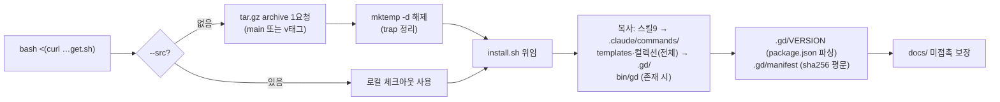

# Implementation Plan: spec-02-02

## 📋 Branch Strategy

- 신규 브랜치: `spec-02-02-get-sh-bootstrap`
- 시작 지점: `phase-02-distribution` (base 브랜치 모드 — 직전 spec PR #7 머지 완료)
- 첫 task 가 브랜치 생성을 수행함

## 🛑 사용자 검토 필요 (User Review Required)

> [!IMPORTANT]
> - [ ] **fetch 방식 = GitHub archive tar.gz** (1요청, `tar` 기본 탑재 — unzip·git 비의존). 대안이던 raw 나열(수십 요청·취약)·release asset(릴리스 절차 선행 필요)은 비채택.
> - [ ] **bash 테스트 도구 = 의존성 없는 셸 어서션** (`test/sh/run.sh`). bats 는 설치 의존이 생겨 비채택.
> - [ ] **소비자 CLAUDE.md fragment = v1 비채택** — 스킬 진입점은 `/gd-plan-start` 로 충분 (YAGNI). 필요해지면 Icebox 승격.

> [!WARNING]
> - [ ] `bin/gd` 는 spec-02-03 산출물 — 본 spec 의 설치 검증 footprint 에서는 제외하고, install.sh 는 "존재 시 복사"로 대비.

## 🎯 핵심 전략 (Core Strategy)

### 아키텍처 컨텍스트



### 주요 결정

| 컴포넌트 | 전략 | 이유 |
|:---:|:---|:---|
| **구조** | get.sh(얇은 부트스트랩) + install.sh(실제 설치) 2층 | harness-kit 실물 동형. get.sh 는 거의 안 바뀌어 curl 대상으로 안정적, 설치 로직은 archive 와 함께 버전됨 — spec-02-03 upgrade 가 같은 install.sh 재사용 가능 |
| **fetch** | `github.com/pgaey/gd-plan/archive/refs/{heads/main, tags/v<ver>}.tar.gz` | 1요청에 컬렉션 포함 전체 수신 (ADR-016 "tarball 이면 동봉 비용 0" 실현). tar 는 macOS/Linux 기본 탑재 |
| **테스트** | 셸 어서션 하네스 + `--src` 로컬 모드 | 의존성 0, 네트워크 0 으로 전 시나리오 검증. bats 는 도구 설치 요구라 비채택 |
| **manifest** | `<sha256>  <path>` 평문 (`shasum -c` 호환) | spec-02-03 충돌 감지의 입력. 표준 형식이라 검증을 기존 도구로 수행 |
| **VERSION 파싱** | `grep '"version"' package.json | sed` | node 비의존로 semver 추출 — jq 의존도 회피 |

### 📑 ADR 후보

- [ ] ADR 가치 있는 결정 있음
- [x] 없음 — 배포 모델은 ADR-016 기록 완료, 본 결정들은 그 구현 세부

## 📂 Proposed Changes

### 설치기 (소비자 bash)

#### [NEW] `get.sh`
- 인자: `[--yes] [--version <semver>] [--src <dir>] <target-dir>` (target 필수 — 실수로 현재 repo 에 설치 방지)
- tar.gz 다운로드(`curl -fsSL`) → `mktemp -d` 해제(`trap` 정리) → `install.sh` 위임. `--src` 시 fetch 생략.

#### [NEW] `install.sh`
- footprint 복사(스킬 9 glob·templates·design-md-collection·bin/gd 존재 시) + `.gd/VERSION` + `.gd/manifest` 기록.
- 기존 `.gd/` 존재 + `--yes` 부재 시 1회 확인. `docs/` 미접촉. macOS bash 3.2 호환.

### bash 테스트

#### [NEW] `test/sh/run.sh`
- `test/sh/test-*.sh` 실행·집계 러너 (PASS/FAIL 카운트, 실패 시 exit 1).

#### [NEW] `test/sh/test-get.sh`
- 시나리오 4건: fresh 설치(footprint·VERSION·manifest `shasum -c`) / docs 미접촉 / 멱등 재실행 / node 비의존(제한 PATH).
- 전부 `--src "$REPO_ROOT"` 로컬 모드 — 네트워크 0.

### 스크립트 등록

#### [MODIFY] `package.json`
- `"test:sh": "bash test/sh/run.sh"` 추가 (기존 `test`·`typecheck` 불변).

## 🧪 검증 계획 (Verification Plan)

### 단위 테스트 (필수)
```bash
pnpm test        # vitest 회귀 (node 측 변경 없음 — 67 PASS 유지)
pnpm test:sh     # 신규 셸 어서션 (시나리오 4건)
pnpm typecheck
```

### 수동 검증 시나리오
1. `bash get.sh --src . --yes /tmp/gd-e2e` → footprint 생성·`shasum -c .gd/manifest` 통과 확인.
2. (push 후) `bash <(curl -fsSL https://raw.githubusercontent.com/pgaey/gd-plan/<branch>/get.sh) --yes /tmp/gd-net` — 실제 네트워크 경로 1회 확인.

## 🔁 Rollback Plan

- 신규 파일(get.sh·install.sh·test/sh) + package.json 1줄 — `git revert` 로 완전 복구.
- 소비자 측 영향 없음 (아직 배포 안내 전 — README 안내는 phase-FF).

## 📦 Deliverables 체크

- [ ] task.md 작성 (다음 단계)
- [ ] 사용자 Plan Accept 받음
- [ ] (실행 후) 모든 task 완료
- [ ] (실행 후) walkthrough.md / pr_description.md ship
