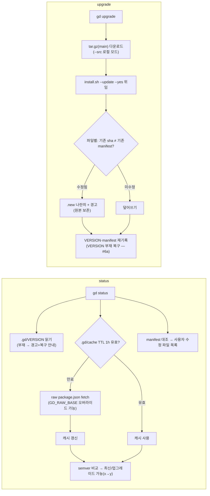

# Implementation Plan: spec-02-03

## 📋 Branch Strategy

- 신규 브랜치: `spec-02-03-gd-consumer-cli`
- 시작 지점: `phase-02-distribution` (직전 spec PR #8 머지 완료)
- 첫 task 가 브랜치 생성을 수행함

## 🛑 사용자 검토 필요 (User Review Required)

> [!IMPORTANT]
> - [ ] **버전 비교 = 자체 semver 함수** — 설계 초안의 `sort -V` 는 macOS(BSD sort) 에 없어 교정. 점 단위 숫자 비교 함수로 대체.
> - [ ] **upgrade 대상 = `main` 고정 (v1)** — release 태그 운영이 시작되면(phase-FF 문서화 후) 태그 핀으로 전환 검토.
> - [ ] **원격 확인 캐시 TTL = 1시간** (`.gd/cache` 평문) — status 를 반복 실행해도 네트워크 1회/시간.

> [!WARNING]
> - [ ] `install.sh` 에 `--update` 모드 추가 — 기존 fresh 설치 경로(spec-02-02 테스트 4건)는 동작 불변이어야 함.
> - [ ] 사용자 수정 파일은 upgrade 후에도 status 에서 계속 "수정됨"으로 표시됨 (manifest = 상류 sha 해석 — 의도된 동작).

## 🎯 핵심 전략 (Core Strategy)

### 아키텍처 컨텍스트



### 주요 결정

| 컴포넌트 | 전략 | 이유 |
|:---:|:---|:---|
| **upgrade 경로** | tar.gz 다운로드 → 동봉 `install.sh --update` 위임 | spec-02-02 의 2층 구조 재사용 — 설치 로직 단일 SoT, gd 는 얇게 유지 |
| **충돌 판정** | "기존 파일 sha ≠ **기존** manifest 항목" = 사용자 수정 | manifest 가 상류 배포 내용의 기록이므로, 어긋남 = 사용자 손댐. 추가 메타데이터 불필요 |
| **semver 비교** | 자체 함수 (점 분리 숫자 비교) | BSD sort 에 `-V` 없음 — 이식성 NFR. 10줄 내외 |
| **원격 캐시** | `.gd/cache` 평문 key=value + TTL 1h | harness-kit `cache.json` 패턴의 평문 번안 (jq 의존 회피) |
| **테스트 격리** | `GD_RAW_BASE` env (file:// 지원) | curl 은 file:// 을 지원 — status 의 원격 비교까지 네트워크 0 으로 검증 |

### 📑 ADR 후보

- [ ] ADR 가치 있는 결정 있음
- [x] 없음 — ADR-016 의 구현 세부

## 📂 Proposed Changes

### 소비자 CLI

#### [NEW] `bin/gd`
- 서브커맨드 `version` / `status` / `upgrade [--src <dir>] [--yes]` + `--help`.
- `.gd/` 루트 탐지: `$GD_HOME` 오버라이드 → 기본 "스크립트 위치의 부모"(`.gd/bin/gd` → `.gd/`). 프로젝트 루트 = `.gd/` 의 부모.
- semver 비교 함수, `.gd/cache` 읽기/쓰기, manifest 대조(수정 파일 목록), tar.gz fetch + `install.sh --update` 위임.

### 설치기 (충돌 정책)

#### [MODIFY] `install.sh`
- `--update` 플래그 추가: 복사 전 파일별로 기존 manifest 와 대조 — 수정 파일은 `<file>.new` 기록 + 경고, 미수정은 덮어쓰기. fresh 경로(플래그 없음)는 동작 불변.
- 종료 요약에 보존된 수정 파일 수 + `.new` 목록 출력.

### bash 테스트

#### [NEW] `test/sh/test-gd.sh`
- 시나리오 5건 (전부 `--src`·`GD_RAW_BASE=file://…` — 네트워크 0):
  1. `gd version` = package.json version.
  2. `gd status` 최신 판정 + 사용자 수정 파일 표시 (템플릿 1개 변조 후).
  3. `gd status` 업그레이드 가능 판정 — 설치 VERSION 을 인위적으로 낮춘 뒤 `업그레이드 가능 (x → y)` 출력 확인.
  4. `gd upgrade` 충돌 보존 — 수정 파일 원본 유지 + `<file>.new` 생성 + 경고, 미수정 파일 갱신, `docs/` diff 0, VERSION·manifest 재기록 (통합 시나리오 2 의 로컬 판).
  5. VERSION 부재 복구 — `rm .gd/VERSION` → status 경고 → upgrade 후 VERSION 복원.

## 🧪 검증 계획 (Verification Plan)

### 단위 테스트 (필수)
```bash
pnpm test        # vitest 67 회귀
pnpm test:sh     # 기존 test-get.sh 4건 + 신규 test-gd.sh 5건
pnpm typecheck
```

### 수동 검증 시나리오
1. 갱신된 `install.sh` 로 fresh 설치가 spec-02-02 테스트로 여전히 PASS 하는지 (`--update` 미지정 경로 불변).
2. (머지 후) phase 통합 시나리오 2 를 실제 네트워크로 재연 — phase-ship 단계에서 수행.

## 🔁 Rollback Plan

- 신규 `bin/gd`·`test/sh/test-gd.sh` + `install.sh` 의 `--update` 분기 — `git revert` 로 완전 복구.
- fresh 설치 경로 불변이 테스트로 고정되므로 롤백 시에도 spec-02-02 기능은 영향 없음.

## 📦 Deliverables 체크

- [ ] task.md 작성 (다음 단계)
- [ ] 사용자 Plan Accept 받음
- [ ] (실행 후) 모든 task 완료
- [ ] (실행 후) walkthrough.md / pr_description.md ship
