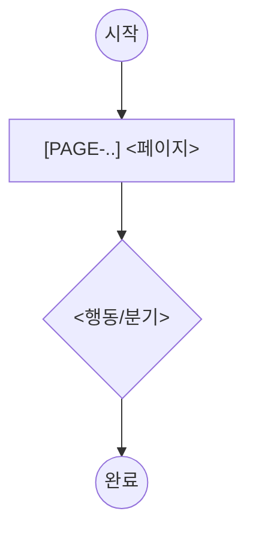

# flows/<flow-slug>.md

> 화면을 가로지르는 사용자 여정 1개 = 파일 1개. flow 마다 이 템플릿을 복사해서 따른다.
> 규칙은 `> 규칙:`. step 은 sitemap.md 로스터의 page 를 참조하고, Actor 는 prd 의 role 이다.
> 이 파일은 `/gd-plan-flows` 인터뷰로 채워진다 (`_name.md` 는 복사용 골격 — 실제 flow 는 `<slug>.md`).

## `[FLOW-<slug>]` <플로우 이름>

- **목적**: <이 여정이 이루려는 것>
- **Actor (role)**: <prd roles 중 하나 — 예: User / Admin>
  > 규칙: flow 는 역할 단위. 같은 목적이라도 역할이 다르면 별도 flow (예: 예약=User / 승인=Admin).
- **Trigger**: <무엇이 이 여정을 시작시키나>

## Steps
> 규칙: 각 step = 행동 + `[PAGE-id]` + 섹션/컴포넌트 + 데이터 (+ modal?).
> 규칙: 참조하는 `[PAGE-id]` 는 sitemap.md 로스터에 존재해야 한다 (없으면 review BLOCK).
1. <행동> @ `[PAGE-..]` — 섹션=<..>, 데이터=<..>
2. <행동> @ `[PAGE-..]` — <...>

## 흐름도 (mermaid)
> 규칙: 위 Steps 의 **시각화** (Steps 가 source of truth). gd-plan-flows 가 Steps 에서 생성/동기화.
> 규칙: 노드 표기 — 시작/끝 `(("..."))`, 페이지 `["[PAGE-id] ..."]`, 행동·분기 `{"..."}`. 가능하면 노드에 `[PAGE-id]` 포함.

## Edge cases
- <실패/예외 경로>: <어떻게 처리>

## Success outcome
<이 여정이 성공적으로 끝났을 때의 상태>

> (선택) 사이트 전체 흐름(여러 flow 합본)은 `flows/_overview.md` 에 manyfast 식 — `subgraph` = 영역(페이지 그룹). gd-plan-flows 가 개별 flow 들에서 자동 합성 가능.
> 작성 예시는 drafts/flow.template.md 참조 (flows/booking.md).
